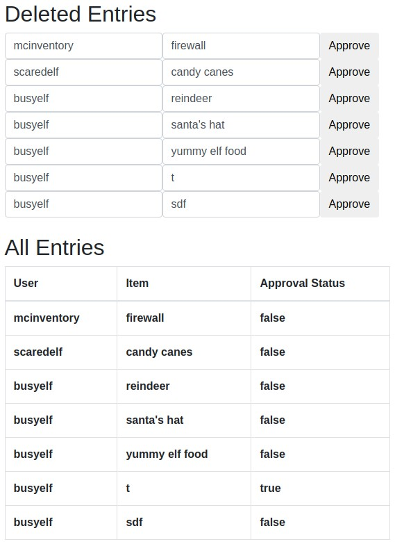

# TryHackMe [Advent of Cyber 1](https://tryhackme.com/room/25daysofchristmas) Day 1
## What is the name of the cookie used for authentication?
1. Register and sign-in.
2. Grab the cookie from the browser's developer tools.

**Answer**: `authid`
## If you decode the cookie, what is the value of the fixed part of the cookie?
```bash
$ echo "dGVzdHY0ZXI5bGwxIXNz" | base64 -d
testv4er9ll1!ss
```

**Answer**: `v4er9ll1!ss`
## After accessing his account, what did the user `mcinventory` request?

`bWNpbnZlbnRvcnl2NGVyOWxsMSFzcw==`