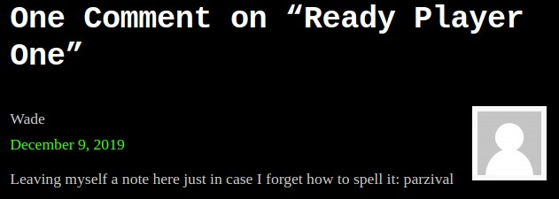
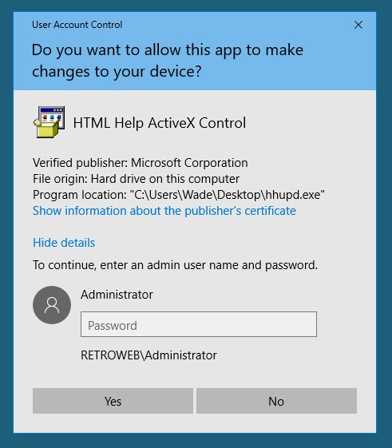
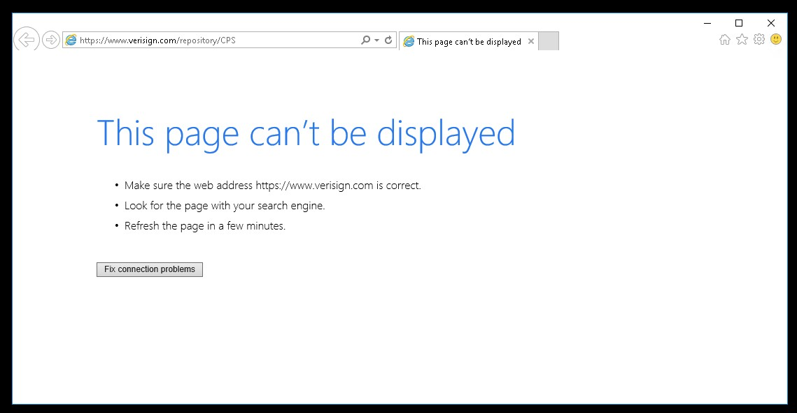
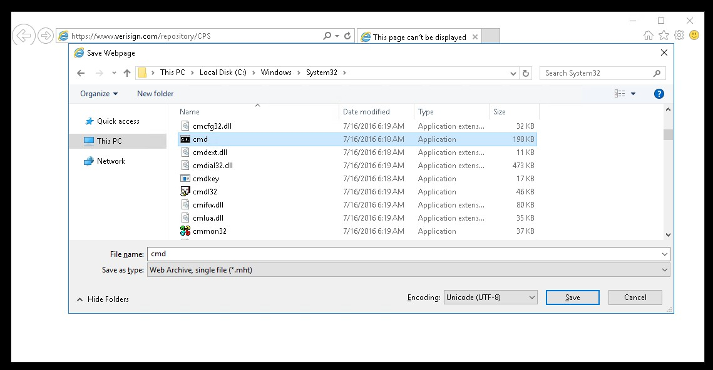

# TryHackMe [Advent of Cyber 1](https://tryhackme.com/room/25daysofchristmas) Day 13
## Reconnaissance
```bash
$ sudo nmap -Pn -sV -p- -vv 10.10.224.185
PORT     STATE SERVICE       REASON          VERSION
80/tcp   open  http          syn-ack ttl 125 Microsoft IIS httpd 10.0
3389/tcp open  ms-wbt-server syn-ack ttl 125 Microsoft Terminal Services
Service Info: OS: Windows; CPE: cpe:/o:microsoft:windows
```
## A web server is running on the target. What is the hidden directory which the website lives on?
```bash
$ gobuster dir -u http://10.10.224.185 -w $(pwd)/directory-list-2.3-medium.txt
/retro                (Status: 301) [Size: 150] [--> http://10.10.224.185/retro/]
```
## Gain initial access and read the contents of `user.txt`
1. Wade made a strange post about his potential password:

2. Connect to his Windows server with username `wade` and password `parzival`.
3. Open `user.txt` with Notepad:


**User Flag**: `THM{HACK_PLAYER_ONE}`
## Elevate privileges and read the content of `root.txt`
1. Open `hhupd.exe` from the Desktop as Administrator and Show more information about the publisher's certificate:

2. Open the link of the certificate with Internet Explorer:

3. Press <kbd>Control</kbd> + <kbd>S</kbd>:

4. Navigate to `C:\Windows\System32`, type `C:\Windows\System32\*.*` in the file name field and open `cmd.exe`:
```
C:\Windows\System32> type ..\..\Users\Administrator\Desktop\root.txt
THM{COIN_OPERATED_EXPLOITATION}
```

**Root Flag**: `THM{COIN_OPERATED_EXPLOITATION}`