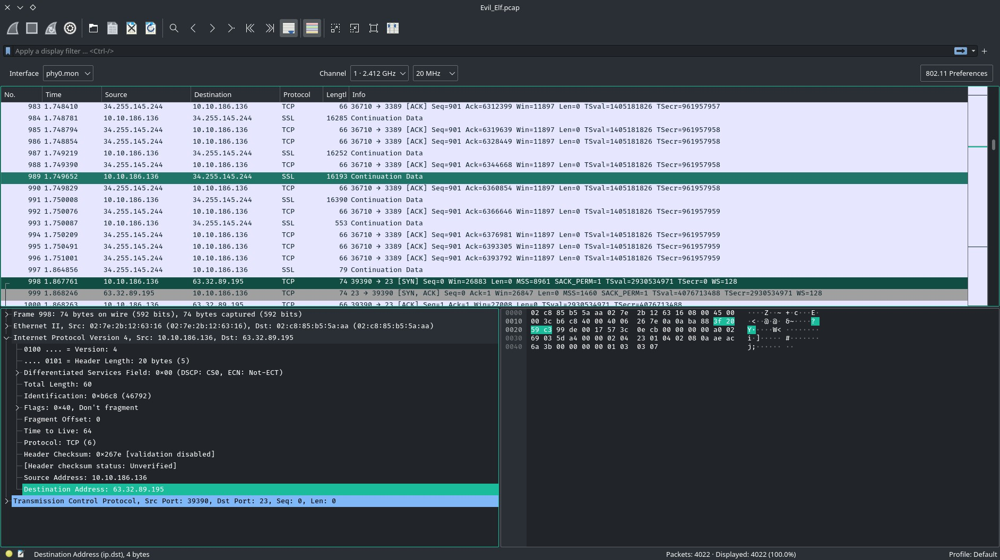

# TryHackMe [Advent of Cyber 1](https://tryhackme.com/room/25daysofchristmas) Day 3
### References
* MuirlandOracle. (2020, January 6). MuirlandOracle. MuirlandOracle’s Blog. https://muirlandoracle.co.uk/2020/01/06/tryhackme-christmas-2019-challenge-write-up/
## Whats the destination IP on packet number 998?
1. On Wireshark, go to frame 998.
2. View the Internet Protocol details and copy the destination address.

**Answer**: `63.32.89.195`
## What item is on the Christmas list?
* Follow the stream of frame 998:
```bash
echo 'ps4' > christmas_list.txt
cat /etc/shadow
root:*:18171:0:99999:7:::
daemon:*:18171:0:99999:7:::
bin:*:18171:0:99999:7:::
sys:*:18171:0:99999:7:::
sync:*:18171:0:99999:7:::
games:*:18171:0:99999:7:::
man:*:18171:0:99999:7:::
lp:*:18171:0:99999:7:::
mail:*:18171:0:99999:7:::
news:*:18171:0:99999:7:::
uucp:*:18171:0:99999:7:::
proxy:*:18171:0:99999:7:::
www-data:*:18171:0:99999:7:::
backup:*:18171:0:99999:7:::
list:*:18171:0:99999:7:::
irc:*:18171:0:99999:7:::
gnats:*:18171:0:99999:7:::
nobody:*:18171:0:99999:7:::
systemd-network:*:18171:0:99999:7:::
systemd-resolve:*:18171:0:99999:7:::
syslog:*:18171:0:99999:7:::
messagebus:*:18171:0:99999:7:::
_apt:*:18171:0:99999:7:::
lxd:*:18171:0:99999:7:::
uuidd:*:18171:0:99999:7:::
dnsmasq:*:18171:0:99999:7:::
landscape:*:18171:0:99999:7:::
sshd:*:18171:0:99999:7:::
pollinate:*:18171:0:99999:7:::
ubuntu:!:18232:0:99999:7:::
buddy:$6$3GvJsNPG$ZrSFprHS13divBhlaKg1rYrYLJ7m1xsYRKxlLh0A1sUc/6SUd7UvekBOtSnSyBwk3vCDqBhrgxQpkdsNN6aYP1:18233:0:99999:7:::
```

**Answer**: `PS4`
## Crack buddy's password!
```bash
$ hashcat -a 0 -m 1800 '$6$3GvJsNPG$ZrSFprHS13divBhlaKg1rYrYLJ7m1xsYRKxlLh0A1sUc/6SUd7UvekBOtSnSyBwk3vCDqBhrgxQpkdsNN6aYP1' rockyou.txt
$6$3GvJsNPG$ZrSFprHS13divBhlaKg1rYrYLJ7m1xsYRKxlLh0A1sUc/6SUd7UvekBOtSnSyBwk3vCDqBhrgxQpkdsNN6aYP1:rainbow

Session..........: hashcat
Status...........: Cracked
Hash.Name........: sha512crypt $6$, SHA512 (Unix)
Hash.Target......: $6$3GvJsNPG$ZrSFprHS13divBhlaKg1rYrYLJ7m1xsYRKxlLh0...N6aYP1
Time.Started.....: Mon Jun 28 16:39:19 2021 (1 sec)
Time.Estimated...: Mon Jun 28 16:39:20 2021 (0 secs)
Guess.Base.......: File (rockyou.txt)
Guess.Queue......: 1/1 (100.00%)
Speed.#2.........:      679 H/s (5.78ms) @ Accel:2 Loops:32 Thr:8 Vec:1
Recovered........: 1/1 (100.00%) Digests
Progress.........: 768/14344384 (0.01%)
Rejected.........: 0/768 (0.00%)
Restore.Point....: 0/14344384 (0.00%)
Restore.Sub.#2...: Salt:0 Amplifier:0-1 Iteration:4992-5000
Candidates.#2....: 123456 -> james1
```
**Answer**: `rainbow`