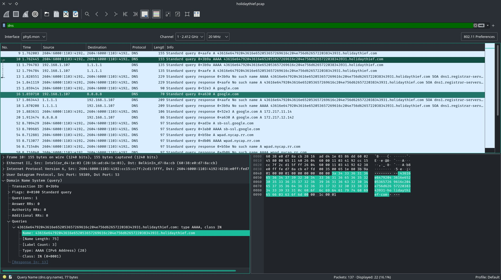
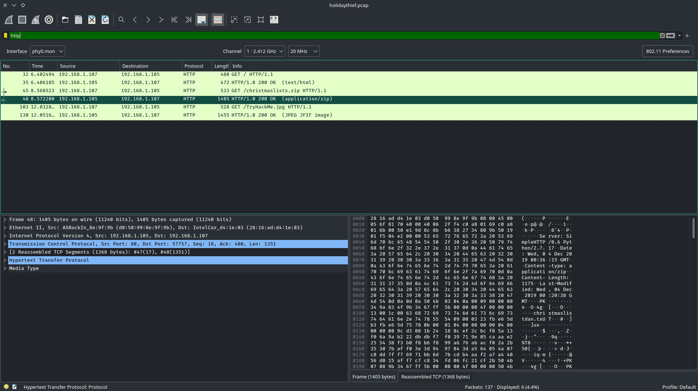

# TryHackMe [Advent of Cyber 1](https://tryhackme.com/room/25daysofchristmas) Day 6
### References
* MuirlandOracle. (2020, January 6). MuirlandOracle. MuirlandOracle’s Blog. https://muirlandoracle.co.uk/2020/01/06/tryhackme-christmas-2019-challenge-write-up/
## What data was exfiltrated via DNS?
1. When filtering for DNS queries, Wireshark shows that the main domain being queried is `43616e64792043616e652053657269616c204e756d6265722038343931.holidaythief.com`:

1. The message is hexadecimally decoded from ascii:
```bash
$ echo '43616e64792043616e652053657269616c204e756d6265722038343931' | xxd -r -p
Candy Cane Serial Number 8491
```

**Answer**: `Candy Cane Serial Number 8491`
## What did Little Timmy want to be for Christmas?
1. In Wireshark, filter for HTTP.

2. Click <kbd>File</kbd> &rarr; <kbd>Export Objects</kbd> &rarr; <kbd>HTTP</kbd>.
3. Crack the ZIP archive's password with `fcrackzip`:
```bash
$ fcrackzip -vbDp rockyou.txt TryHackMe/Advent_of_Cyber1/Day6/christmaslists.zip 
found file 'christmaslistdan.tx', (size cp/uc     91/    79, flags 9, chk 9a34)
found file 'christmaslistdark.txt', (size cp/uc     91/    82, flags 9, chk 9a4d)
found file 'christmaslistskidyandashu.txt', (size cp/uc    108/   116, flags 9, chk 9a74)
found file 'christmaslisttimmy.txt', (size cp/uc    105/   101, flags 9, chk 9a11)
possible pw found: december ()
```
4. Extract `christmaslists.zip` with the passphrase `december`:
```bash
$ unzip christmaslists.zip
Archive:  christmaslists.zip
[christmaslists.zip] christmaslistdan.tx password: december
 extracting: christmaslistdan.tx
  inflating: christmaslistdark.txt
  inflating: christmaslistskidyandashu.txt
  inflating: christmaslisttimmy.txt
```
5. Read `christmaslisttimmy.txt`:
```bash
$ cat christmaslisttimmy.txt 
Dear Santa,
For Christmas I would like to be a PenTester! Not the Bic kind!
Thank you,
Little Timmy.
```

**Answer**: `PenTester`
## What was hidden within the file?
1. Extract file from `TryHackMe.jpg` (without a passphrase):
```bash
$ steghide extract -sf TryHackMe.jpg
Enter passphrase: 
wrote extracted data to "christmasmonster.txt".
```
2. The 2nd line of `christmasmonster.txt` contains an unrelated string `RFC527`.

**Answer**: `RFC527`