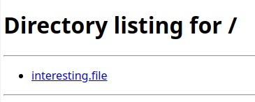

# TryHackMe [Advent of Cyber 1](https://tryhackme.com/room/25daysofchristmas) Day 7
### References
* MuirlandOracle. (2020, January 6). MuirlandOracle. MuirlandOracle’s Blog. https://muirlandoracle.co.uk/2020/01/06/tryhackme-christmas-2019-challenge-write-up/
## Reconnaissance
```bash
$ sudo nmap -sS -A -p-1000 10.10.86.134
PORT    STATE SERVICE VERSION
22/tcp  open  ssh     OpenSSH 7.4 (protocol 2.0)
| ssh-hostkey: 
|   2048 33:c8:23:ec:bf:4a:60:72:cf:76:79:5f:c9:41:da:b1 (RSA)
|   256 a5:c7:1d:13:1d:54:43:96:06:0f:42:b5:cc:27:f7:06 (ECDSA)
|_  256 60:a8:02:1c:bf:03:41:a2:52:5a:5d:bc:9b:30:3b:02 (ED25519)
111/tcp open  rpcbind 2-4 (RPC #100000)
| rpcinfo: 
|   program version    port/proto  service
|   100000  2,3,4        111/tcp   rpcbind
|   100000  2,3,4        111/udp   rpcbind
|   100000  3,4          111/tcp6  rpcbind
|   100000  3,4          111/udp6  rpcbind
|   100024  1          36627/tcp   status
|   100024  1          52821/udp6  status
|   100024  1          55255/tcp6  status
|_  100024  1          57389/udp   status
999/tcp open  http    SimpleHTTPServer 0.6 (Python 3.6.8)
|_http-server-header: SimpleHTTP/0.6 Python/3.6.8
|_http-title: Directory listing for /
No exact OS matches for host (If you know what OS is running on it, see https://nmap.org/submit/ ).
TCP/IP fingerprint:
OS:SCAN(V=7.91%E=4%D=6/29%OT=22%CT=1%CU=42942%PV=Y%DS=4%DC=T%G=Y%TM=60DA7AA
OS:7%P=x86_64-unknown-linux-gnu)SEQ(SP=105%GCD=1%ISR=10C%TI=Z%CI=Z%II=I%TS=
OS:A)SEQ(SP=108%GCD=1%ISR=10B%TI=Z%CI=Z%TS=D)OPS(O1=M505ST11NW6%O2=M505ST11
OS:NW6%O3=M505NNT11NW6%O4=M505ST11NW6%O5=M505ST11NW6%O6=M505ST11)WIN(W1=68D
OS:F%W2=68DF%W3=68DF%W4=68DF%W5=68DF%W6=68DF)ECN(R=Y%DF=Y%T=FF%W=6903%O=M50
OS:5NNSNW6%CC=Y%Q=)T1(R=Y%DF=Y%T=FF%S=O%A=S+%F=AS%RD=0%Q=)T2(R=N)T3(R=N)T4(
OS:R=Y%DF=Y%T=FF%W=0%S=A%A=Z%F=R%O=%RD=0%Q=)T5(R=Y%DF=Y%T=FF%W=0%S=Z%A=S+%F
OS:=AR%O=%RD=0%Q=)T6(R=Y%DF=Y%T=FF%W=0%S=A%A=Z%F=R%O=%RD=0%Q=)T7(R=Y%DF=Y%T
OS:=FF%W=0%S=Z%A=S+%F=AR%O=%RD=0%Q=)U1(R=Y%DF=N%T=FF%IPL=164%UN=0%RIPL=G%RI
OS:D=G%RIPCK=G%RUCK=G%RUD=G)IE(R=Y%DFI=N%T=FF%CD=S)

Network Distance: 4 hops

TRACEROUTE (using port 80/tcp)
HOP RTT       ADDRESS
1   26.44 ms  10.4.0.1
2   ... 3
4   296.25 ms 10.10.86.134
```
## How many TCP ports under 1000 are open?
**Answer**: `3`
## What is the name of the OS of the host?
**Answer**: `Linux`
## What version of SSH is running?
**Answer**: `7.4`
## What is the name of the file that is accessible on the server you found running?
1. A Python HTTP server is running on port 999 and path of `/`.
2. By accessing this server via a browser:


**Answer**: `interesting.file`