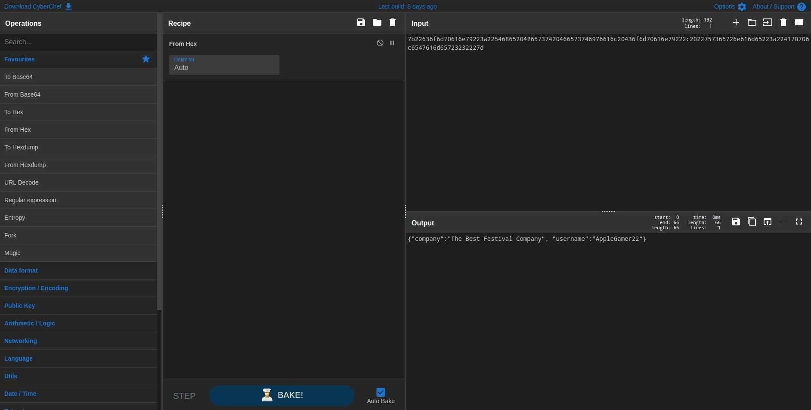
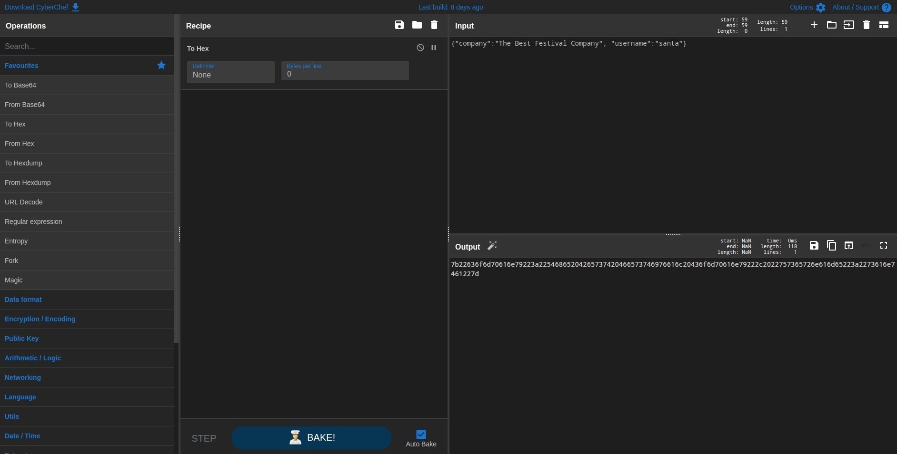
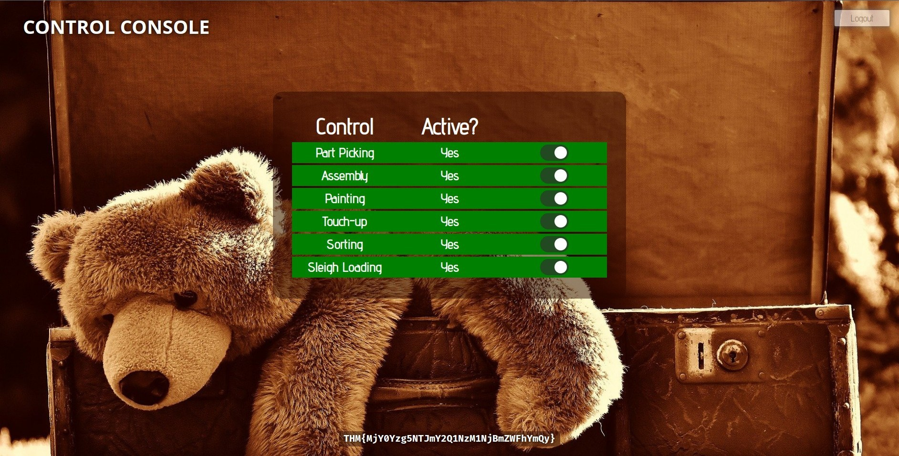

# TryHackMe Advent of Cyber Day 1
### References
* Hammond, J. (2020). TryHackMe! Advent Of Cyber 2 - Kick-Off [YouTube Video]. In YouTube. https://youtu.be/BJF84oWHmok

## What is the name of the cookie used for authentication?
1. Press <kbd>F12</kbd> in order to access your browser's developer tools.
2. Navigate to <kbd>Application</kbd> > <kbd>Cookies</kbd>.
3. Get cookies information

**Answer**: `auth`
## In what format is the value of this cookie encoded?
**Answer**: The cookie is encoded with *Hexadecimal* format:
```
7b22636f6d70616e79223a22546865204265737420466573746976616c20436f6d70616e79222c2022757365726e616d65223a224170706c6547616d65723232227d
```
## Having decoded the cookie, what format is the data stored in?

By using [CyberChef](https://gchq.github.io/CyberChef/#recipe=From_Hex('Auto')), the hex string mentioned above translates to:
```json
{
	"company":"The Best Festival Company",
	"username":"AppleGamer22"
}
```
## What is the value of Santa's cookie?

By using [CyberChef](https://gchq.github.io/CyberChef/#recipe=To_Hex('None',0)), decode the modified *JSON* back to *hexadecimal* format.
```json
{
	"company":"The Best Festival Company",
	"username":"santa"
}
```
**Answer**: Santa's cookie has a value of:
```
7b22636f6d70616e79223a22546865204265737420466573746976616c20436f6d70616e79222c2022757365726e616d65223a2273616e7461227d
```
Replace the current `auth` cookie value with Santa's cookie value.
## What is the flag you're given when the line is fully active?

1. Refresh the page after overwriting your cookie's value with Santa's.
2. Enable all toggles

**Flag**: `THM{MjY0Yzg5NTJmY2Q1NzM1NjBmZWFhYmQy}`