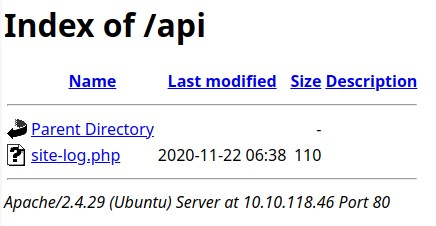

# TryHackMe [Advent of Cyber 2](https://tryhackme.com/room/adventofcyber2) Day 4
### References
* DarkSec. (2020). TryHackMe Advent of Cyber 2: Day 4 [YouTube Video]. In YouTube. https://youtu.be/7GAFQdYCk5s

## Given the URL `http://shibes.xyz/api.php`, what would the entire `wfuzz` command look like to query the `breed` parameter using the word list `big.txt`?
> **Note**: For legal reasons, do not actually run this command as the site in question has not consented to being fuzzed!

**Answer**: `wfuzz -c -z file,big.txt http://shibes.xyz/api.php?breed=FUZZ`
## Use `gobuster` **(against the target you deployed - not the`shibes.xyz` domain)** to find the API directory. What file is there?

1. Find the path of the API directory:
```bash
$ gobuster dir -u http://<MACHINE_IP> -w $(pwd)/big.txt -x .php
/.htpasswd            (Status: 403) [Size: 277]
/.htaccess.php        (Status: 403) [Size: 277]
/.htpasswd.php        (Status: 403) [Size: 277]
/.htaccess            (Status: 403) [Size: 277]
/LICENSE              (Status: 200) [Size: 1086]
/api                  (Status: 301) [Size: 310] [--> http://<MACHINE_IP>/api/]
```
2. Go to `http://<MACHINE_IP>/api/` and find the `site-log.php` file:


**Answer**: `site-log.php`

## Fuzz the date parameter on the file you found in the API directory. What is the flag displayed in the correct post?
1. Use the provided word list to fuzz the server:
```bash
$ wfuzz -c -z file,$(pwd)/wordlist.txt -u http://<MACHINE_IP>/api/site-log.php?date=FUZZ
=====================================================================
ID           Response   Lines    Word       Chars       Payload   
=====================================================================
000000003:   200        0 L      0 W        0 Ch        "20201102"
000000006:   200        0 L      0 W        0 Ch        "20201105"
000000010:   200        0 L      0 W        0 Ch        "20201109"
000000001:   200        0 L      0 W        0 Ch        "20201100"
000000002:   200        0 L      0 W        0 Ch        "20201101"
000000007:   200        0 L      0 W        0 Ch        "20201106"
000000008:   200        0 L      0 W        0 Ch        "20201107"
000000005:   200        0 L      0 W        0 Ch        "20201104"
000000009:   200        0 L      0 W        0 Ch        "20201108"
000000004:   200        0 L      0 W        0 Ch        "20201103"
000000037:   200        0 L      0 W        0 Ch        "20201206"
000000034:   200        0 L      0 W        0 Ch        "20201203"
000000033:   200        0 L      0 W        0 Ch        "20201202"
000000032:   200        0 L      0 W        0 Ch        "20201201"
000000012:   200        0 L      0 W        0 Ch        "20201111"
000000016:   200        0 L      0 W        0 Ch        "20201115"
000000035:   200        0 L      0 W        0 Ch        "20201204"
000000036:   200        0 L      0 W        0 Ch        "20201205"
000000038:   200        0 L      0 W        0 Ch        "20201207"
000000024:   200        0 L      0 W        0 Ch        "20201123"
000000027:   200        0 L      0 W        0 Ch        "20201126"
000000030:   200        0 L      0 W        0 Ch        "20201129"
000000029:   200        0 L      0 W        0 Ch        "20201128"
000000022:   200        0 L      0 W        0 Ch        "20201121"
000000021:   200        0 L      0 W        0 Ch        "20201120"
000000031:   200        0 L      0 W        0 Ch        "20201130"
000000025:   200        0 L      0 W        0 Ch        "20201124"
000000028:   200        0 L      0 W        0 Ch        "20201127"
000000026:   200        0 L      1 W        13 Ch       "20201125"
000000023:   200        0 L      0 W        0 Ch        "20201122"
000000014:   200        0 L      0 W        0 Ch        "20201113"
000000018:   200        0 L      0 W        0 Ch        "20201117"
000000019:   200        0 L      0 W        0 Ch        "20201118"
000000015:   200        0 L      0 W        0 Ch        "20201114"
000000011:   200        0 L      0 W        0 Ch        "20201110"
000000041:   200        0 L      0 W        0 Ch        "20201210"
000000020:   200        0 L      0 W        0 Ch        "20201119"
000000017:   200        0 L      0 W        0 Ch        "20201116"
000000013:   200        0 L      0 W        0 Ch        "20201112"
000000039:   200        0 L      0 W        0 Ch        "20201208"
000000045:   200        0 L      0 W        0 Ch        "20201214"
000000058:   200        0 L      0 W        0 Ch        "20201227"
000000053:   200        0 L      0 W        0 Ch        "20201222"
000000059:   200        0 L      0 W        0 Ch        "20201228"
000000061:   200        0 L      0 W        0 Ch        "20201230"
000000063:   200        0 L      0 W        0 Ch        "http://<MACHINE_IP>/api/site-log.php?date="
000000056:   200        0 L      0 W        0 Ch        "20201225"
000000057:   200        0 L      0 W        0 Ch        "20201226"
000000062:   200        0 L      0 W        0 Ch        "20201231"
000000060:   200        0 L      0 W        0 Ch        "20201229"
000000050:   200        0 L      0 W        0 Ch        "20201219"
000000046:   200        0 L      0 W        0 Ch        "20201215"
000000055:   200        0 L      0 W        0 Ch        "20201224"
000000048:   200        0 L      0 W        0 Ch        "20201217"
000000051:   200        0 L      0 W        0 Ch        "20201220"
000000052:   200        0 L      0 W        0 Ch        "20201221"
000000044:   200        0 L      0 W        0 Ch        "20201213"
000000047:   200        0 L      0 W        0 Ch        "20201216"
000000054:   200        0 L      0 W        0 Ch        "20201223"
000000049:   200        0 L      0 W        0 Ch        "20201218"
000000042:   200        0 L      0 W        0 Ch        "20201211"
000000043:   200        0 L      0 W        0 Ch        "20201212"
000000040:   200        0 L      0 W        0 Ch        "20201209"
```
2. There is only one payload (`20201125`) that results in a viable response:
```bash
$ curl http://10.10.245.102/api/site-log.php?date=20201125
THM{D4t3_AP1}
```

**Flag**: `THM{D4t3_AP1}`