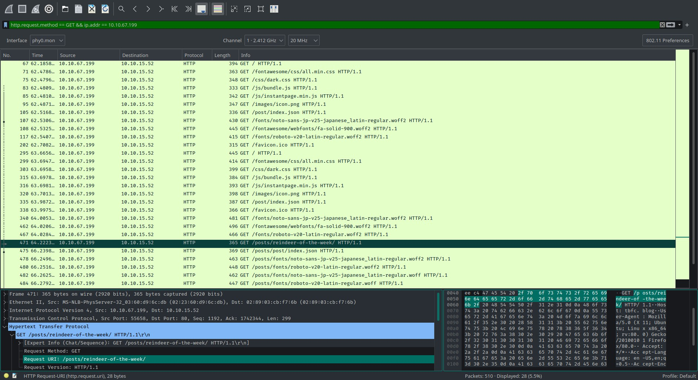
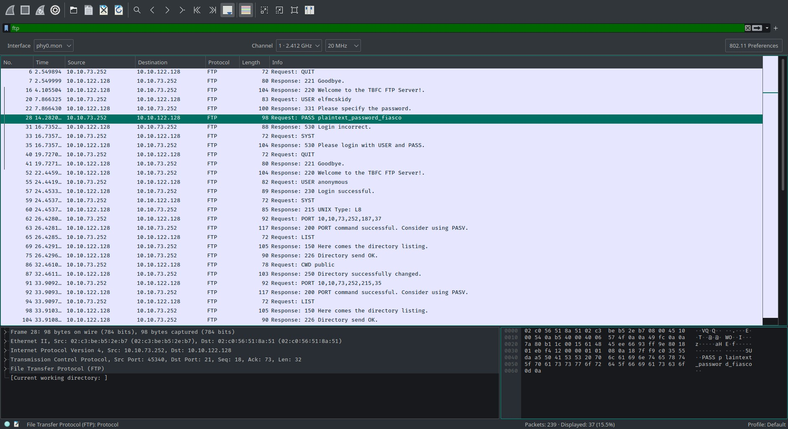

# TryHackMe [Advent of Cyber 2](https://tryhackme.com/room/adventofcyber2) Day 7
## Open `pcap1.pcap` in Wireshark. What is the IP address that initiates an ICMP/ping?
1. open pcap
2. filter `icmp`
3. find sender of 1st ping
**Answer**: `10.11.3.2`

## If we only wanted to see HTTP GET requests in our `pcap1.pcap` file, what filter would we use?
**Answer**: `http.request.method == GET`

## Now apply this filter to `pcap1.pcap` in Wireshark, what is the name of the article that the IP address **`10.10.67.199`** visited?

1. Use filter `http.request.method == GET && ip.addr == 10.10.67.199`.
2. Look for HTTP GET requests with a URI that has `/posts/` as a substring (according to the hint):


**Answer**: `reindeer-of-the-week`

## Let's begin analyzing `pcap2.pcap`. Look at the captured FTP traffic; what password was leaked during the login process?
1. Filter by ftp
2. look for user input that looks like a bad password:


**Answer**: `plaintext_password_fiasco`

## Continuing with our analysis of `pcap2.pcap`, what is the name of the protocol that is encrypted?
* SSH is being used.

**Answer**: `SSH`

## What is on Elf McSkidy's (`pcap3.pcap`) wishlist that will be used to replace Elf McEager?

1. Export the sniffed `christmas.zip` from the HTTP traffic.
2. Extract the files from the archive:

```bash
$ unzip christmas.zip
Archive:  christmas.zip
  inflating: AoC-2020.png
  inflating: christmas-tree.jpg
  inflating: elf_mcskidy_wishlist.txt
  inflating: Operation Artic Storm.pdf
  inflating: selfie.jpg
  inflating: tryhackme_logo_full.svg
```

3. Open `elf_mcskidy_wishlist.txt`

```
Wish list for Elf McSkidy
-------------------------
Budget: £100

x3 Hak 5 Pineapples
x1 Rubber ducky (to replace Elf McEager)
```

**Answer**: `Rubber ducky`