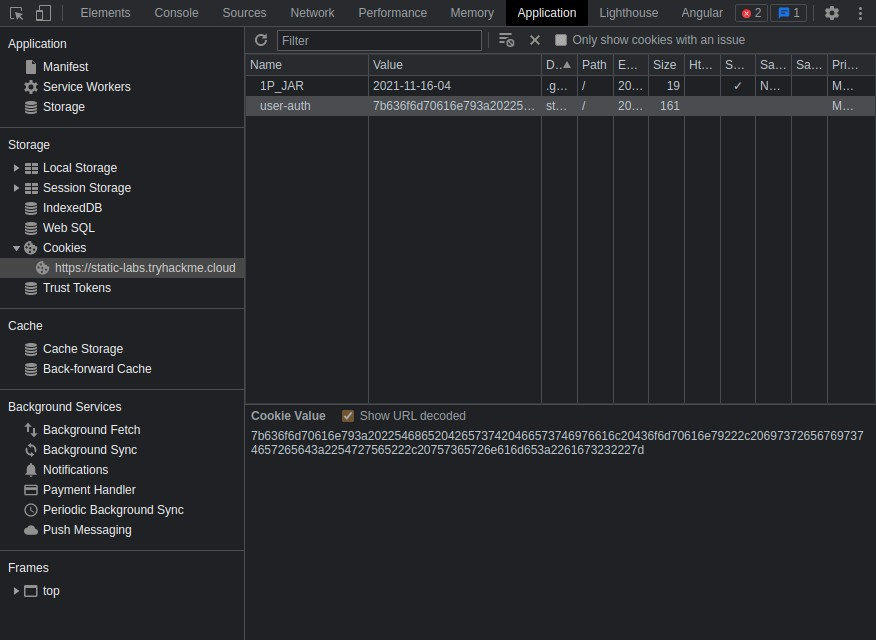
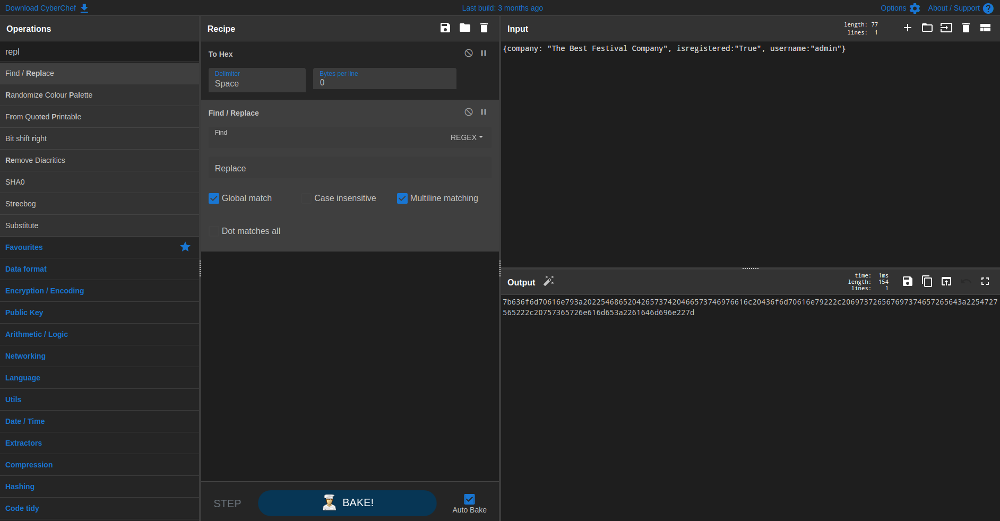
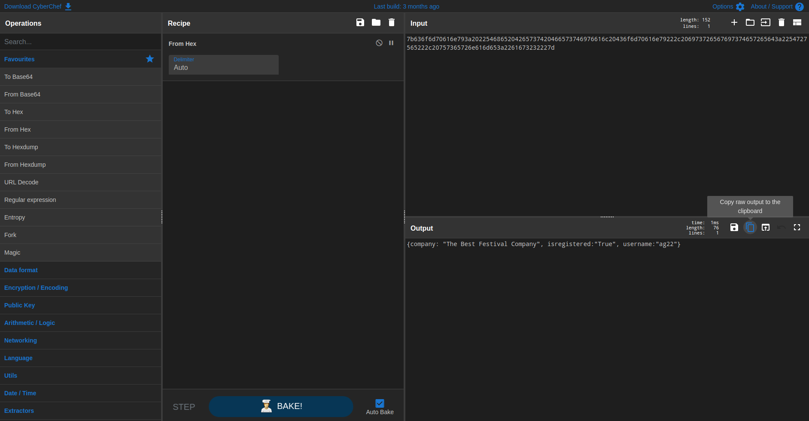
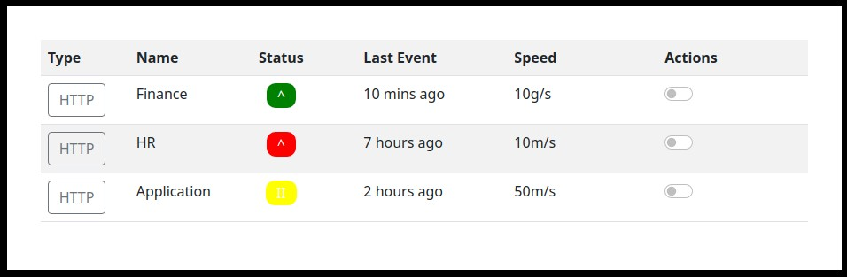

# TryHackMe Advent of Cyber 3 Day 2
### References
* Try Hack Me. (2021). Advent of Cyber 3, Day 2 - Cookies and Authentication [YouTube Video]. In YouTube. https://youtu.be/bovOGgp_TbE

## What is the name of the new cookie that was created for your account?

**Answer**: `user-auth`
## What encoding type was used for the cookie value?
* The `user-auth` cookie seem to contain decimal digits and lowercase latin letters from A to F, which seems to be a hexadecimal encoding scheme where each hexadecimal digit encodes 4 bits of information.

**Answer**: `hexadecimal`
## What object format is the data of the cookie stored in?

**Answer**: `JSON`
## What is the value of the administrator cookie (username of `admin`)?
1. Copy the JSON string to a new [CyberChef](https://gchq.github.io/CyberChef/) recipe, change the `username` field to `admin`, convert the hexadecimal encoding and trim the space delimiters.

2. Modify the `user-auth` cookie value to the tempered JSON-Hexadecimal string via your browser's DevTools

**Answer**: `7b636f6d70616e793a2022546865204265737420466573746976616c20436f6d70616e79222c206973726567697374657265643a2254727565222c20757365726e616d653a2261646d696e227d`
## What team environment is not responding?

**Answer**: `HR`
## What team environment has a network warning?
**Answer**: `Application`

