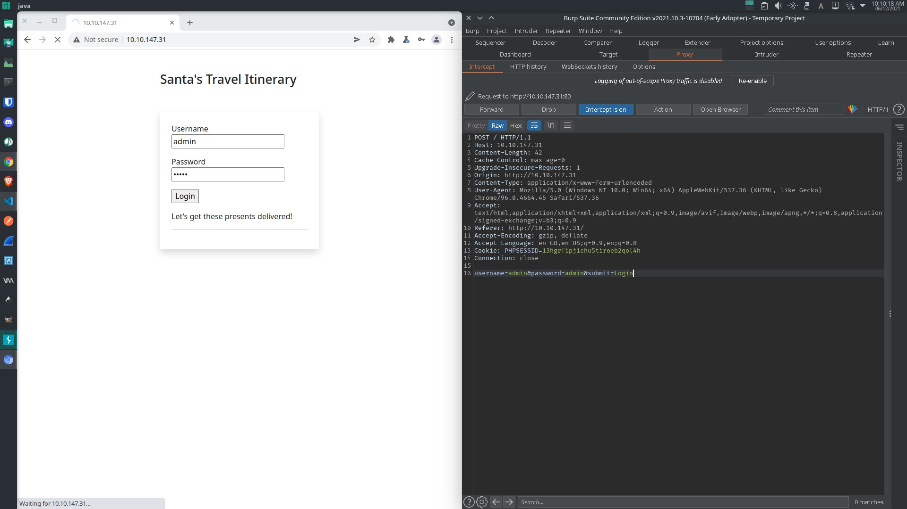

# TryHackMe [Advent of Cyber 3](https://tryhackme.com/room/adventofcyber3) Day 4
### References
* Nahamsec. (2021). TryHackMe’s Advent of Cyber - Day 4: Fuzzing with Burp Suite [YouTube Video]. In YouTube. https://youtu.be/jT8-HE95G5Q

## What valid password can you use to access the `santa` account?
1. Set the target as `<MACHINE_IP>`:

2. Intercept the sign-in HTTP request via BurpSuite's proxy:

```http
POST / HTTP/1.1
Host: 10.10.147.31
Content-Length: 42
Cache-Control: max-age=0
Upgrade-Insecure-Requests: 1
Origin: http://10.10.147.31
Content-Type: application/x-www-form-urlencoded
User-Agent: Mozilla/5.0 (Windows NT 10.0; Win64; x64) AppleWebKit/537.36 (KHTML, like Gecko) Chrome/96.0.4664.45 Safari/537.36
Accept: text/html,application/xhtml+xml,application/xml;q=0.9,image/avif,image/webp,image/apng,*/*;q=0.8,application/signed-exchange;v=b3;q=0.9
Referer: http://10.10.147.31/
Accept-Encoding: gzip, deflate
Accept-Language: en-GB,en-US;q=0.9,en;q=0.8
Cookie: PHPSESSID=13hgrfipj1chu5tiroeb2qol4h
Connection: close

username=admin&password=admin&submit=Login
```
3. Set the the target for BurpSuite's intruder:

4. Copy the sign-in HTTP request to BurpSuite's intruder's position:

5. Set BurpSuite's intruder's payload:

6. The response length of the sign-in request with username `santa` and password of `cookie` is different than the rest:


**Answer**: `cookie`
## What is the flag in Santa's itinerary?
**Flag**: `THM{SANTA_DELIVERS}`
