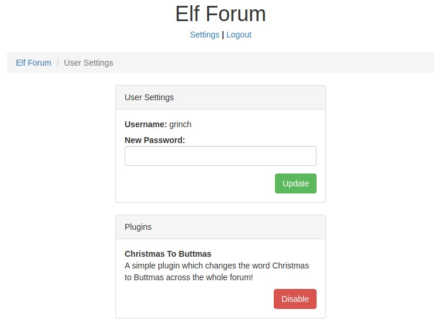

# TryHackMe [Advent of Cyber 3](https://tryhackme.com/room/adventofcyber3) Day 5
### References
* Nahamsec. (2021). TryHackMe’s Advent of Cyber - Day 5: Web Exploitation - Cross-site Scripting (XSS) Explained [YouTube Video]. In YouTube. https://youtu.be/uA1OHCgArzI

## What flag did you get when you disabled the plugin?
1. On, `http://<MACHINE_IP>/login`, sign-in as `McSkidy` with password `password`.
2. Post a forum comment with the following HTML/JavaScript code:
```html
<script>fetch('/settings?new_password=pass123');</script>
```
3. Sign-out and sign-in as `grinch` with password `pass123`
4. Under `http://<MACHINE_IP>/settings`, disable the plugin:


**Flag**: `THM{NO_MORE_BUTTMAS}`