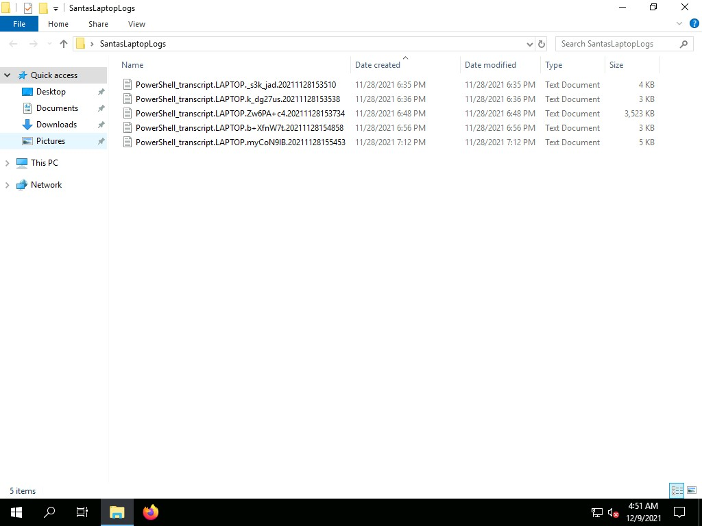
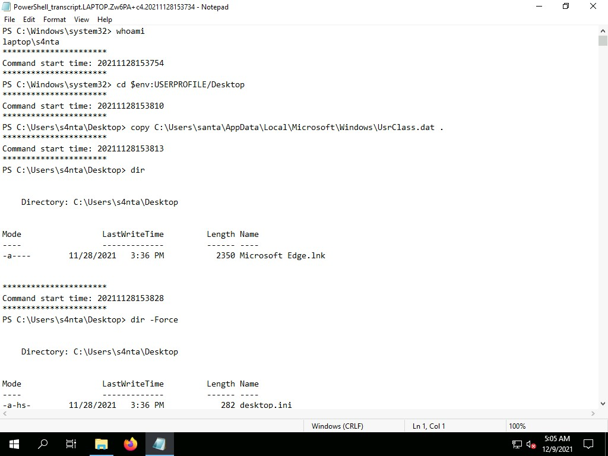
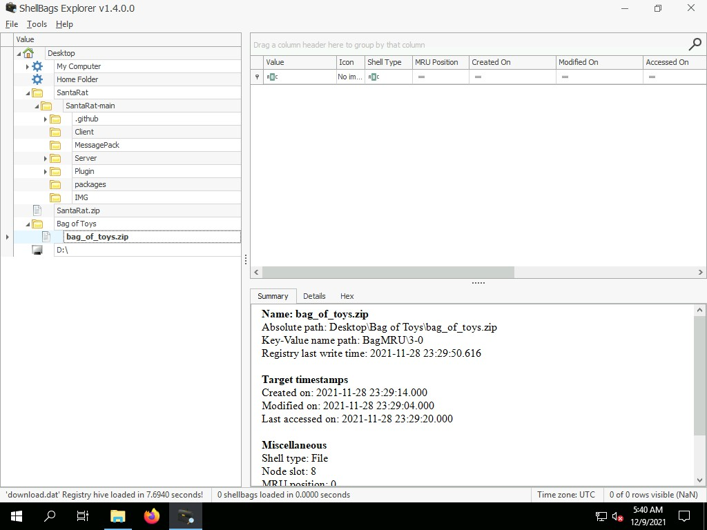
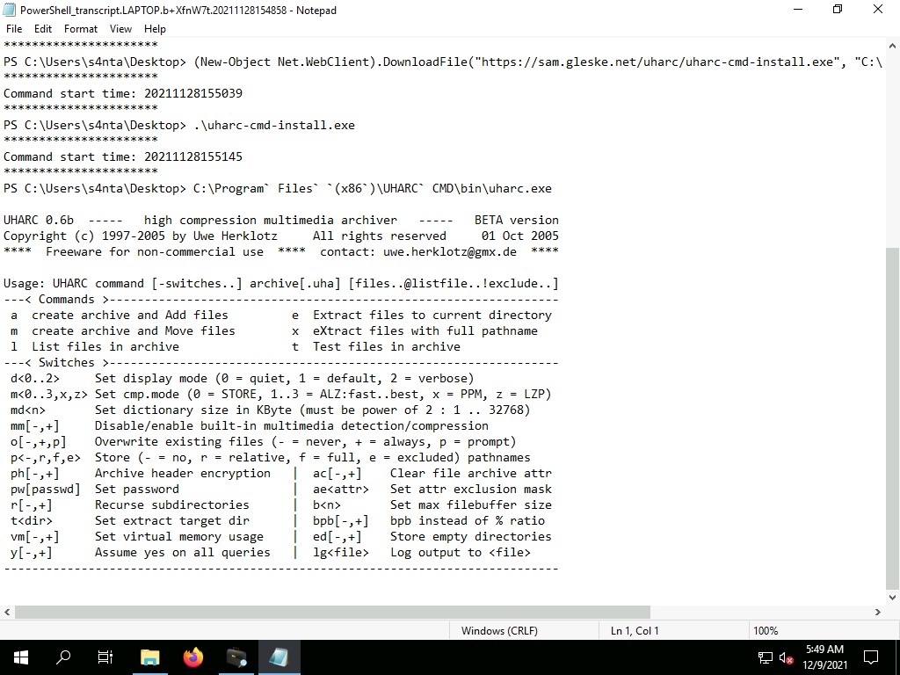
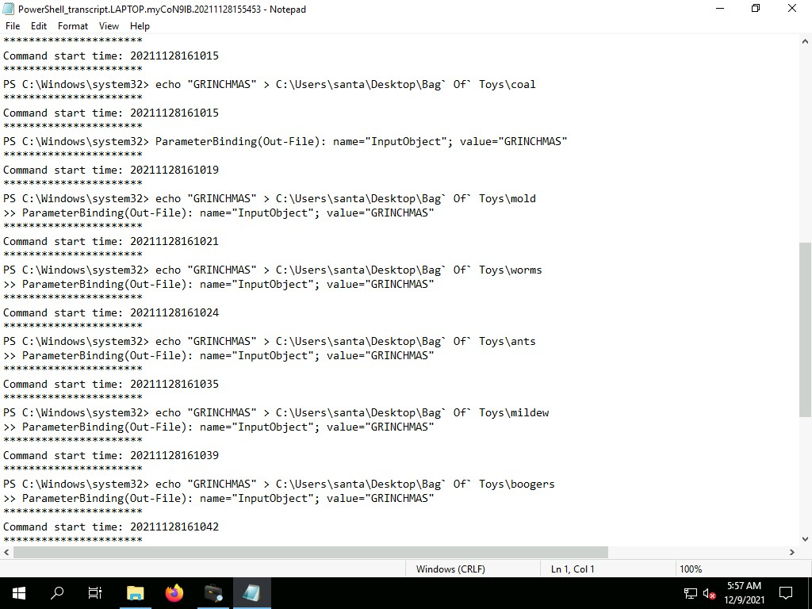
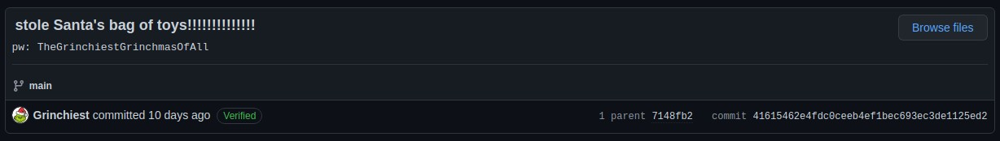
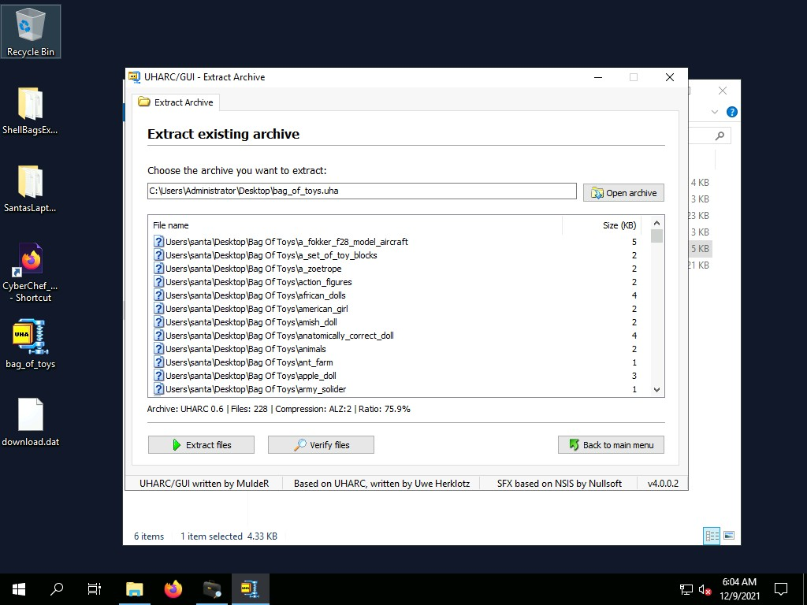

# TryHackMe [Advent of Cyber 3](https://tryhackme.com/room/adventofcyber3) Day 8
### References
* Hammond, J. (2021). Windows Shellbags & UHARC Compression: TryHackMe! AoC Day 8 "Santa’s Bag of Toys" [YouTube Video]. In YouTube. https://youtu.be/oGX7vLtjbic

## What operating system is Santa's laptop running (OS Name)?
* The desktop contains a folder with various logs:

* The first-created (`PowerShell_transcript.LAPTOP._s3k_jad.20211128153510.txt`) log describes the username and OS details:

**Answer**: `Microsoft Windows 11 Pro`
## In the second transcription log, it seems as if the perpetrator created a backdoor user account! **What was the password set for the new `backdoor` account?**
* In the second-created log (`PowerShell_transcript.LAPTOP.k_dg27us.20211128153538.txt`), the threat actor creates a `s4nta` user with password `grinchstolechristmas`, which is then added to the Administrators group:

**Answer**: `grinchstolechristmas`
## In one of the transcription logs,  the bad actor interacts with the target under the new backdoor user account, and copies a unique file to the Desktop. Before it is copied to the Desktop, **what is the full path of the original file?**
* In the third-created log file (`PowerShell_transcript.LAPTOP.Zw6PA+c4.20211128153734.txt`), the file `C:\Users\santa\AppData\Local\Microsoft\Windows\UsrClass.dat` is copied to `s4nta`'s desktop:

**Answer**: `C:\Users\santa\AppData\Local\Microsoft\Windows\UsrClass.dat`
## The actor uses a [Living Off The Land](https://lolbas-project.github.io/lolbas/Binaries/Certutil/) binary (LOLbin) to encode this file, and then verifies it succeeded by viewing the output file. **What is the name of this LOLbin?**
* According to [LOLBAS](https://lolbas-project.github.io/lolbas/Binaries/Certutil/)

**Answer**: `certutil.exe`
## Drill down into the folders and see if you can find anything that might indicate how we could better track down what this SantaRat really is. **What specific folder name clues us in that this might be publicly accessible software hosted on a code-sharing platform?**
* After Base64-decoding the `UsrClass.dat` file with CyberChef, and opening the result with ShellBegs, The `Desktop/SantaRat/SantaRat-main/.github` suggests that the code is stored on GitHub, since a `.github` folder is used for storing GitHub-specific repository metadata.

**Answer**: `.github`
## Additionally, there is a unique folder named `Bag of Toys` on the Desktop! This must be where Santa prepares his collection of toys, and this is certainly sensitive data that the actor could have compromised. **What is the name of the file found in this folder?**
* Bag of Toys folder:

**Answer**: `bag_of_toys.zip`
## What is the name of the user that owns the `SantaRat` repository?
* [`Grinchiest/SantaRat`](https://github.com/Grinchiest/SantaRat)

**Answer**: `Grinchiest`
## Explore the other repositories that this user owns. What is the name of the repository that seems especially pertinent to our investigation?
* [`Grinchiest/operation-bag-of-toys`](https://github.com/Grinchiest/operation-bag-of-toys)

**Answer**: `operation-bag-of-toys`
## You can review the activity in the transcription logs. It looks as if the actor installed a special utility to collect and eventually exfiltrate the bag of toys. **What is the name of the executable that installed a unique utility the actor used to collect the bag of toys?**
* Within the fourth-created log (`PowerShell_transcript.LAPTOP.b+XfnW7t.20211128154858.txt`), it is recorded that the threat actor downloaded a program from <https://sam.gleske.net/uharc/uharc-cmd-install.exe>:

**Answer**: `uharc-cmd-install.exe`
## Following this, the threat actor looks to have removed everything from the bag of toys, and added in new things like coal, mold, worms, and more!  What are the contents of these "malicious" files (coal, mold, and all the others)?
* In the last-created log (`PowerShell_transcript.LAPTOP.myCoN9lB.20211128155453.txt`), `GRINCHMAS` is `echo`ed to the corrupted files:

**Answer**: `GRINCHMAS`
## What is the password to the original `bag_of_toys.uha` archive?
* This [commit](https://github.com/Grinchiest/operation-bag-of-toys/commit/41615462e4fdc0ceeb4ef1bec693ec3de1125ed2) contains a supposed password for the encrypted archive:

**Answer**: `TheGrinchiestGrinchmasOfAll`
## How many original files were present in Santa's Bag of Toys?
* After extracting the encrypted archive with the password `TheGrinchiestGrinchmasOfAll`, the GUI indicates that there were 228 files in the original archive:

**Answer**: `228`
