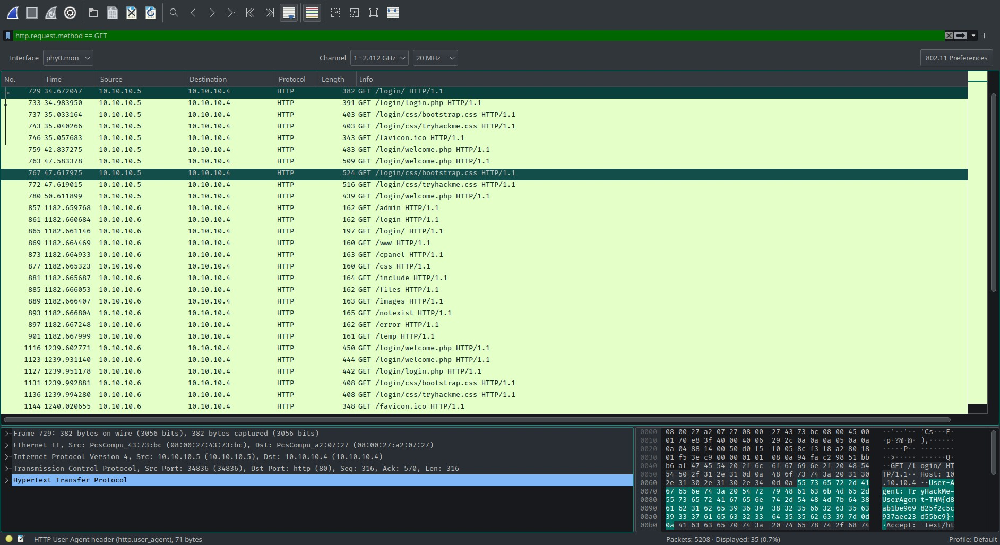
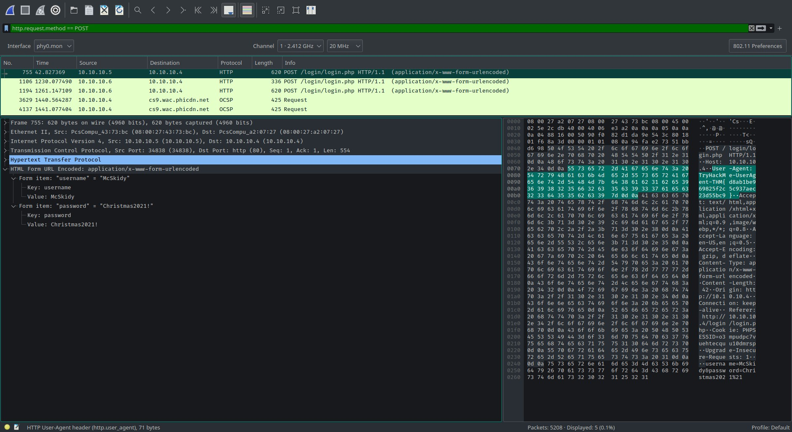
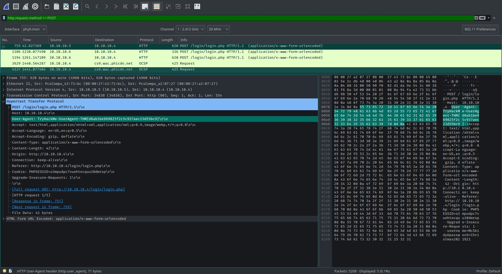
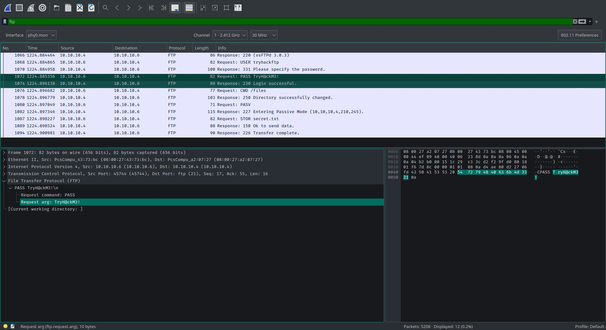
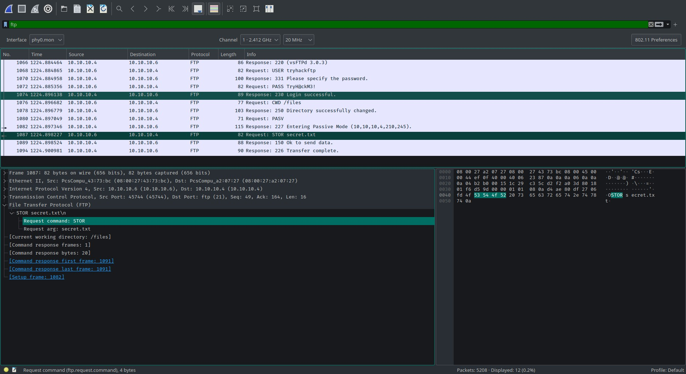
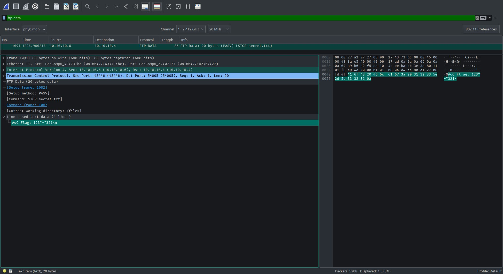

# TryHackMe [Advent of Cyber 3](https://tryhackme.com/room/adventofcyber3) Day 9
### References
* Alh4zr3d. (2021). Advent of Cyber Day 9: Packet Analysis with Wireshark [YouTube Video]. In YouTube. https://youtu.be/LnBT1qubCnc
* Wikipedia Contributors. (2021, November 24). List of DNS record types. Wikipedia; Wikimedia Foundation. https://en.wikipedia.org/wiki/List_of_DNS_record_types

## In the **HTTP \#1 - GET** requests section, which directory is found on the web server?

**Answer**: `login`
## What is the username and password used in the login page in the **HTTP #2 - POST** section? 

**Answer**: `McSkidy:Christmas2021!`
## What is the `User-Agent`'s name that has been sent in **HTTP #2 - POST** section?

**Flag**: `TryHackMe-UserAgent-THM{d8ab1be969825f2c5c937aec23d55bc9}`
## In the DNS section, there is a TXT DNS query. What is the flag in the message of that DNS query?
* 16 is the decimal code for DNS TXT queries.

**Flag**: `THM{dd63a80bf9fdd21aabbf70af7438c257}`
## In the FTP section, what is the FTP login password?

**Answer**: `TryH@ckM3!`
## In the FTP section, what is the FTP command used to upload the `secret.txt` file?

## In the FTP section, what is the content of the `secret.txt` file?

**Answer**: `123^-^321`