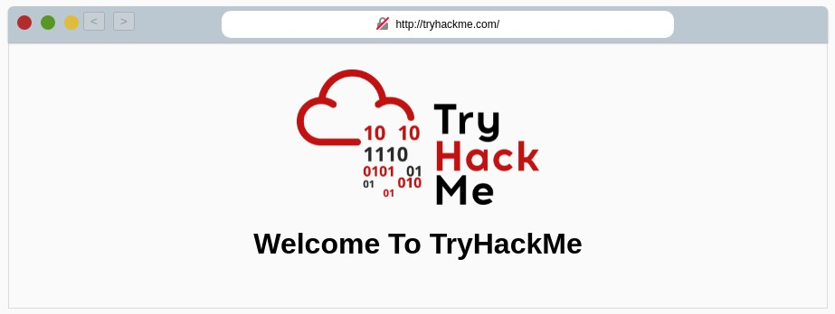

# TryHackMe [HTTP in Detail](https://www.tryhackme.com/room/httpindetail)
## What is HTTP(S)?
### What does HTTP stand for?
**Answer**: `HyperText Transfer Protocol`
### What does the S in HTTPS stand for?
**Answer**: `Secure`
### On the mock webpage on the right there is an issue, once you've found it, click on it. What is the challenge flag?
* The page does not support HTTPS, click on the lock next to the page's address.


**Flag**: `THM{INVALID_HTTP_CERT}`
## Requests & Responses
#### Example Request:
```http
GET / HTTP/1.1
Host: tryhackme.com
User-Agent: Mozilla/5.0 Firefox/87.0
Referer: https://tryhackme.com/
```
#### Example Response:
```http
HTTP/1.1 200 OK
Server: nginx/1.15.8
Date: Fri, 09 Apr 2021 13:34:03 GMT
Content-Type: text/html
Content-Length: 98

<html>
<head>
	<title>TryHackMe</title>
</head>
<body>
	Welcome To TryHackMe.com
</body>
</html>
```
### What HTTP protocol is being used in the above example?
**Answer**: `HTTP/1.1`
### What response header tells the browser how much data to expect?
**Answer**: `Content-Length`
## HTTP Methods
### What method would be used to create a new user account?
* According to the information provided in the question:
> #### `POST` Request
> This is used for submitting data to the web server and potentially creating new records.

**Answer**: `POST`
### What method would be used to update your email address?
* According to the information provided in the question:
> #### `PUT` Request
> This is used for submitting data to a web server to update information.

**Answer**: `PUT`
### What method would be used to remove a picture you've uploaded to your account?
* According to the information provided in the question:
> #### `DELETE` Request
> This is used for deleting information/records from a web server.

**Answer**: `DELETE`
### What method would be used to view a news article?
* According to the information provided in the question:
> #### `GET` Request
> This is used for getting information from a web server.

**Answer**: `GET`
## HTTP Status Codes
### What response code might you receive if you've created a new user or blog post article?
* According to the information provided in the question:
> 201 - Created | A resource has been created (for example a new user or new blog post).
> --|--

**Answer**: `201`
### What response code might you receive if you've tried to access a page that doesn't exist?
* According to the information provided in the question:
> 404 - Page Not Found | The page/resource you requested does not exist.
> --|--

**Answer**: `404`
### What response code might you receive if the web server cannot access its database and the application crashes?
* According to the information provided in the question:
> 503 - Service Unavailable | This server cannot handle your request as it's either overloaded or down for maintenance.
> --|--

**Answer**: `503`
### What response code might you receive if you try to edit your profile without logging in first?
* According to the information provided in the question:
> 401 - Not Authorised | You are not currently allowed to view this resource until you have authorised with the web application, most commonly with a username and password.
> --|--

**Answer**: `401`
## Headers
### What header tells the web server what browser is being used?
* According to the information provided in the question:
> **`User-Agent`**: This is your browser software and version number, telling the web server your browser software helps it format the website properly for your browser and also some elements of HTML, JavaScript and CSS are only available in certain browsers.

**Answer**: `User-Agent`
### What header tells the browser what type of data is being returned?
* According to the information provided in the question:
> **`Content-Type`**: This tells the client what type of data is being returned, i.e., HTML, CSS, JavaScript, Images, PDF, Video, etc. Using the `Content-Type` header the browser then knows how to process the data.

**Answer**: `Content-Type`
### What header tells the web server which website is being requested?
* According to the information provided in the question:
> **`Host`**: Some web servers host multiple websites so by providing the `Host` headers you can tell it which one you require, otherwise you'll just receive the default website for the server.

**Answer**: `Host`
## Cookies
### Which header is used to save cookies to your computer?
* According to the information provided in the question:
> Cookies are saved when you receive a `Set-Cookie` header from a web server.

**Answer**: `Set-Cookie`
## Making Requests
### Make a `GET` request to `/room`
* Request:
```http
GET /room HTTP/1.1
Host: tryhackme.com
User-Agent: Mozilla/5.0 Firefox/87.0
```
* Response:
```http
HTTP/1.1 200 Ok
Server: nginx/1.15.8
Fri, 14 May 2021 18:35:9 GMT
Content-Type: text/html; charset=utf-8
Content-Length: 233
Last-Modified: Fri, 14 May 2021 18:35:9 GMT

<html>
<head>
	<title>TryHackMe</title>
</head>
<body>
	Welcome to the Room page THM{YOU'RE_IN_THE_ROOM}
</body>
</html>
```

**Flag**: `THM{YOU'RE_IN_THE_ROOM}`
### Make a `GET` request to `/blog` and using the gear icon set the `id` parameter to `1` in the URL field
* Request:
```http
GET /blog?id=1 HTTP/1.1
Host: tryhackme.com
User-Agent: Mozilla/5.0 Firefox/87.0
```
* Response:
```http
HTTP/1.1 200 Ok
Server: nginx/1.15.8
Fri, 14 May 2021 18:36:42 GMT
Content-Type: text/html; charset=utf-8
Content-Length: 231
Last-Modified: Fri, 14 May 2021 18:36:42 GMT

<html>
<head>
	<title>TryHackMe</title>
</head>
<body>
	Viewing Blog article 1 THM{YOU_FOUND_THE_BLOG}
</body>
</html>
```

**Flag**: `THM{YOU_FOUND_THE_BLOG}`
### Make a `DELETE` request to `/user/1`
* Request:
```http
DELETE /user/1 HTTP/1.1
Host: tryhackme.com
User-Agent: Mozilla/5.0 Firefox/87.0
Content-Length: 0
```
* Response:
```http
HTTP/1.1 200 Ok
Server: nginx/1.15.8
Fri, 14 May 2021 18:38:32 GMT
Content-Type: text/html; charset=utf-8
Content-Length: 231
Last-Modified: Fri, 14 May 2021 18:38:32 GMT

<html>
<head>
	<title>TryHackMe</title>
</head>
<body>
	The user has been deleted THM{USER_IS_DELETED}
</body>
</html>
```

**Flag**: `THM{USER_IS_DELETED}`
### Make a `PUT` request to `/user/2` with the `username` parameter set to `admin`
* Request:
```http
PUT /user/2 HTTP/1.1
Host: tryhackme.com
User-Agent: Mozilla/5.0 Firefox/87.0
Content-Length: 14

username=admin
```
* Response:
```http
HTTP/1.1 200 Ok
Server: nginx/1.15.8
Fri, 14 May 2021 18:40:30 GMT
Content-Type: text/html; charset=utf-8
Content-Length: 232
Last-Modified: Fri, 14 May 2021 18:40:30 GMT

<html>
<head>
	<title>TryHackMe</title>
</head>
<body>
	Username changed to admin THM{USER_HAS_UPDATED}
</body>
</html>
```

**Flag**: `THM{USER_HAS_UPDATED}`
### `POST` the `username` of `thm` and a `password` of `letmein` to `/login`
* Request:
```http
POST /login HTTP/1.1
Host: tryhackme.com
User-Agent: Mozilla/5.0 Firefox/87.0
Content-Length: 33

username=thm&password=letmein
```
* Response:
```http
HTTP/1.1 200 Ok
Server: nginx/1.15.8
Fri, 14 May 2021 18:42:50 GMT
Content-Type: text/html; charset=utf-8
Content-Length: 237
Last-Modified: Fri, 14 May 2021 18:42:50 GMT

<html>
<head>
	<title>TryHackMe</title>
</head>
<body>
	You logged in! Welcome Back THM{HTTP_REQUEST_MASTER}
</body>
</html>
```

**Flag**: `THM{HTTP_REQUEST_MASTER}`