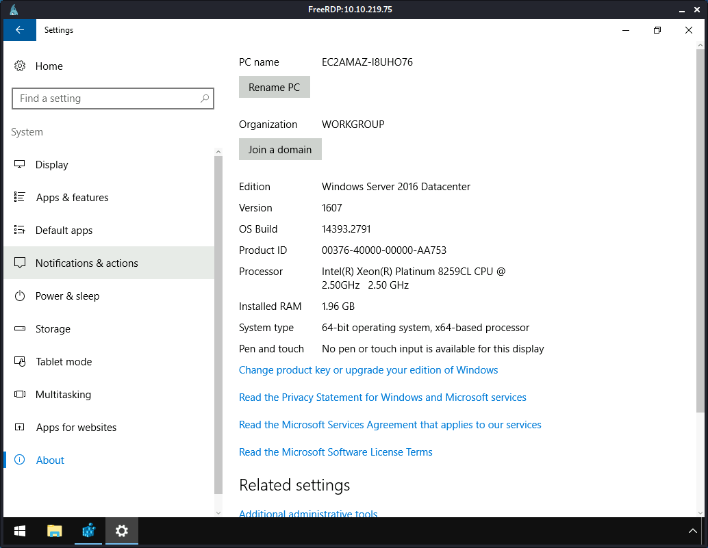
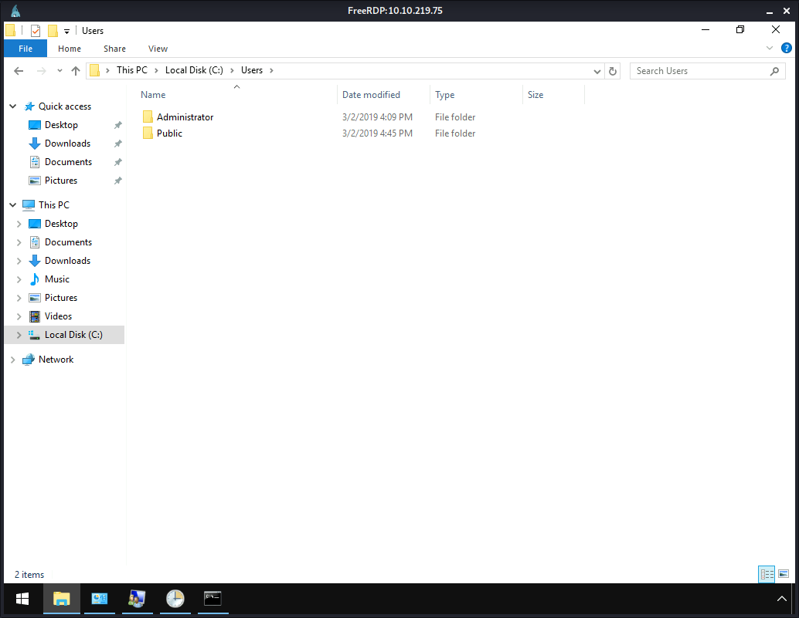
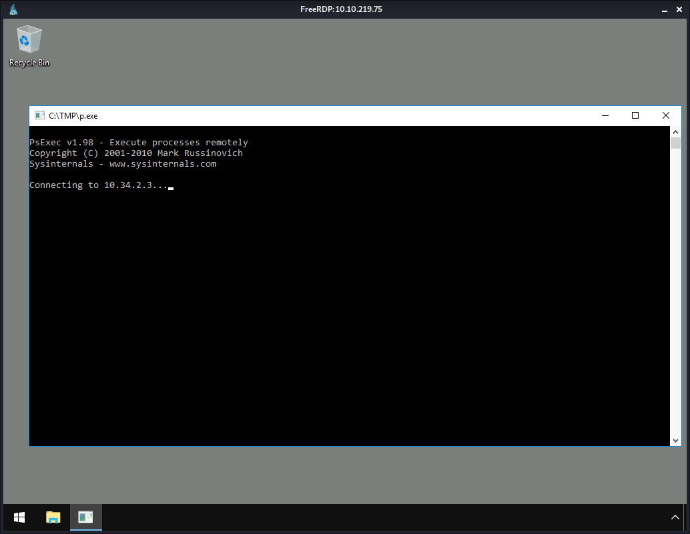
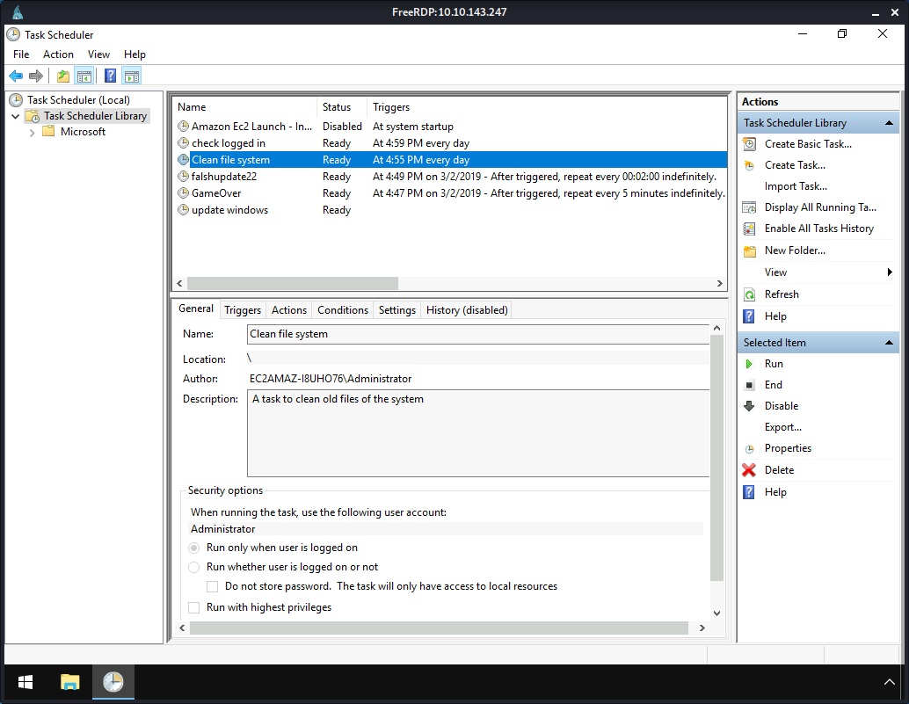
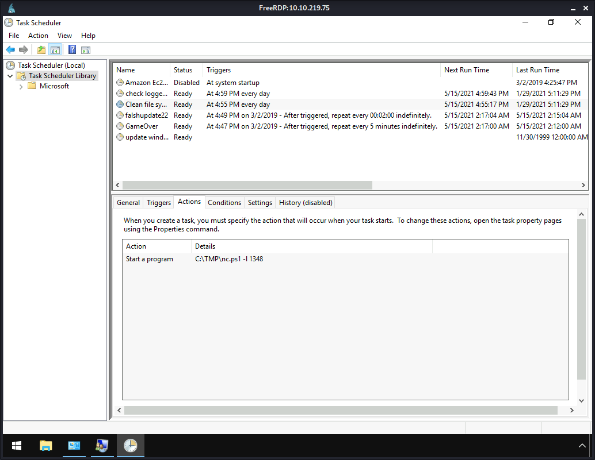
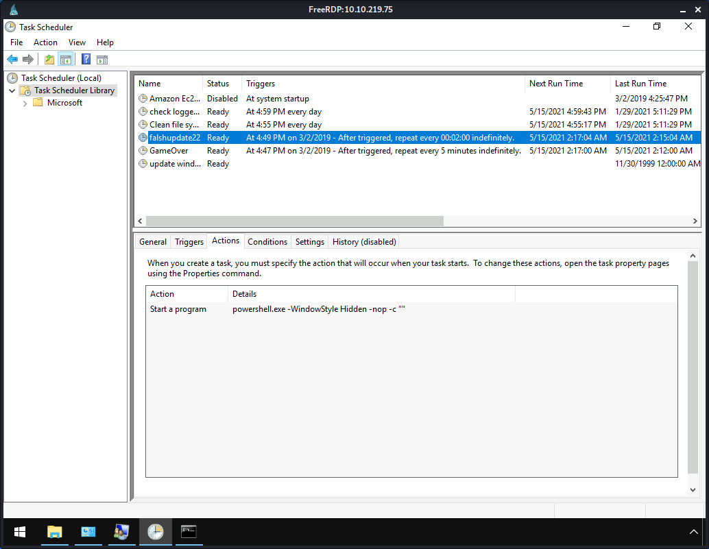
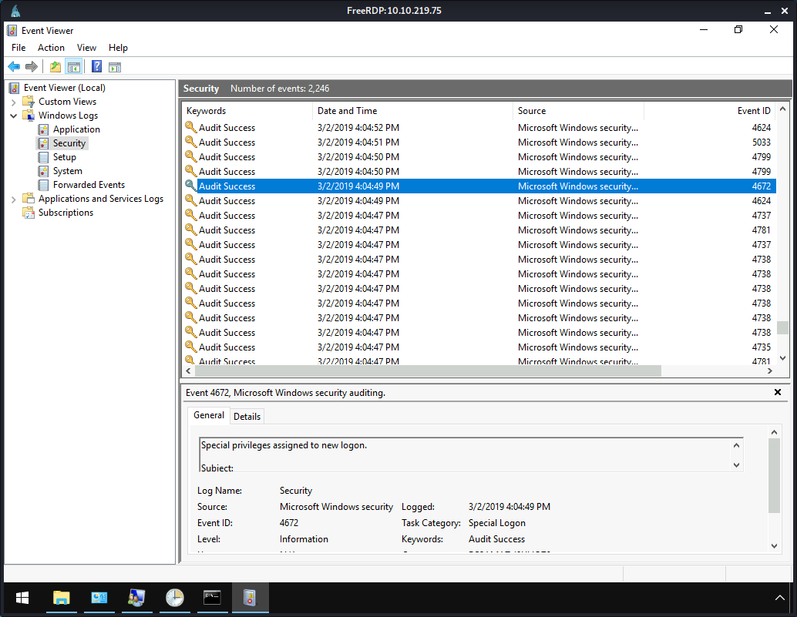
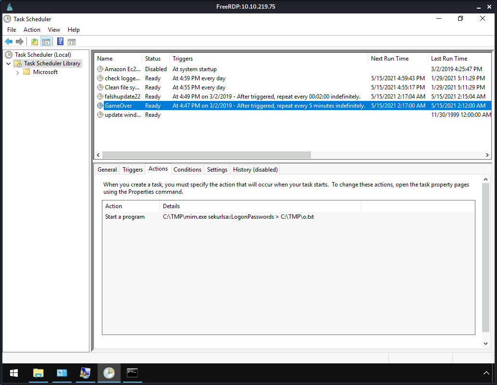
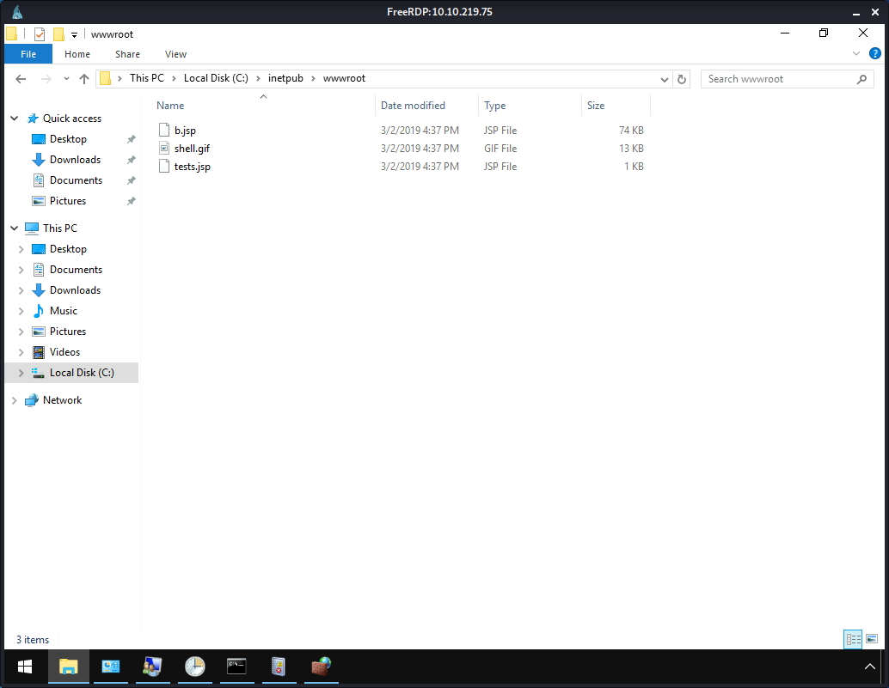
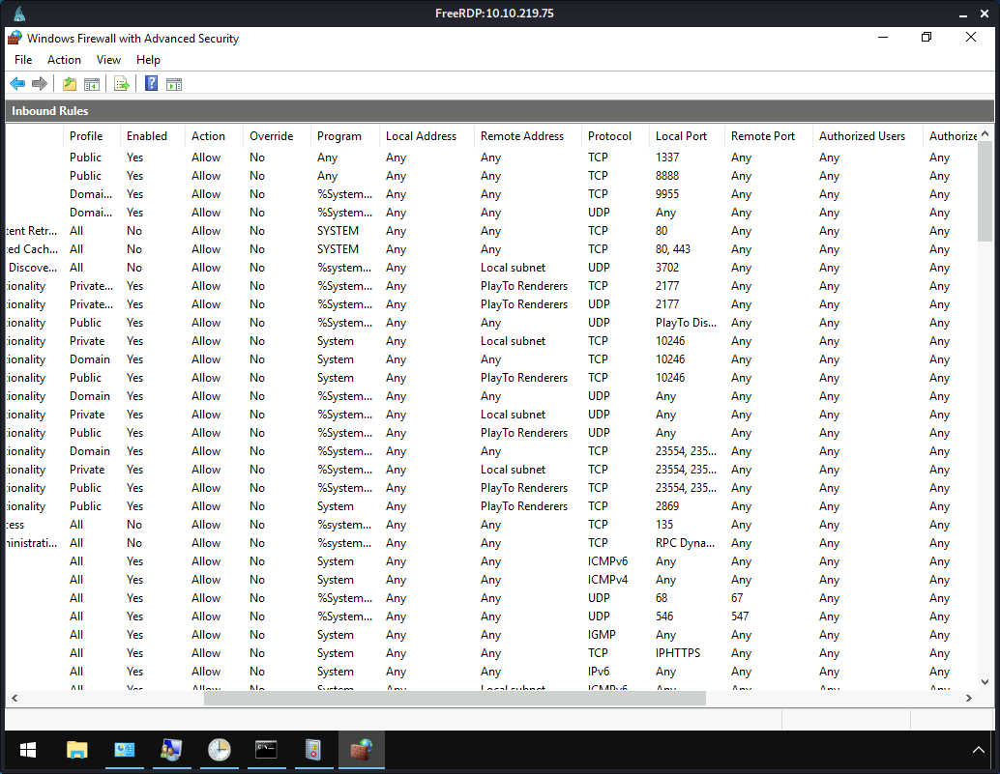

# TryHackMe [Investigating Windows](https://tryhackme.com/room/investigatingwindows)
### References
* 7s26simon. (2021). TryHackMe - Investigating Windows Part 1 [YouTube Video]. In YouTube. https://youtu.be/wmwi8DDtsf8
* 7s26simon. (2021). TryHackMe - Investigating Windows Part 2 [YouTube Video]. In YouTube. https://youtu.be/oYYwygCMgnE
## Whats the version and year of the windows machine?

**Answer**: `Windows Server 2016`
## Which user logged in last?

**Answer**: `Administrator`
## When did John log onto the system last?
```
C:\Users\Administrator>net user John
User name                    John
Full Name                    John
Comment
User's comment
Country/region code          000 (System Default)
Account active               Yes
Account expires              Never

Password last set            3/2/2019 5:48:19 PM
Password expires             Never
Password changeable          3/2/2019 5:48:19 PM
Password required            Yes
User may change password     Yes

Workstations allowed         All
Logon script
User profile
Home directory
Last logon                   3/2/2019 5:48:32 PM

Logon hours allowed          All

Local Group Memberships      *Users
Global Group memberships     *None
The command completed successfully.
```
**Answer**: `03/02/2019 5:48:32 PM`
## What IP does the system connect to when it first starts?

**Answer**: `10.34.2.3`
## What two accounts had administrative privileges (other than the Administrator user)?

**Answer**: `Jenny, Guest`
## Whats the name of the scheduled task that is malicious?

**Answer**: `Clean file system`
## What file was the task trying to run daily?

**Answer**: `nc.ps1`
## What port did this file listen locally for?
**Answer**: `1348`
## When did Jenny last logon?
```
C:\Users\Administrator>net user Jenny
User name                    Jenny
Full Name                    Jenny
Comment
User's comment
Country/region code          000 (System Default)
Account active               Yes
Account expires              Never

Password last set            3/2/2019 4:52:25 PM
Password expires             Never
Password changeable          3/2/2019 4:52:25 PM
Password required            Yes
User may change password     Yes

Workstations allowed         All
Logon script
User profile
Home directory
Last logon                   Never

Logon hours allowed          All

Local Group Memberships      *Administrators       *Users
Global Group memberships     *None
The command completed successfully.
```
**Answer**: `Never`
## At what date did the compromise take place?

**Answer**: `03/02/2019`
## At what time did Windows first assign special privileges to a new logon?

**Answer**: `03/02/2019 4:04:49 PM`
## What tool was used to get Windows passwords?

**Answer**: `Mimikatz`
## What was the attackers external control and command servers IP?
* `C:\Windows\System32\Drivers\etc\hosts`:
```
10.2.2.2	update.microsoft.com
127.0.0.1  www.virustotal.com
127.0.0.1  www.www.com
127.0.0.1  dci.sophosupd.com
10.2.2.2	update.microsoft.com
127.0.0.1  www.virustotal.com
127.0.0.1  www.www.com
127.0.0.1  dci.sophosupd.com
10.2.2.2	update.microsoft.com
127.0.0.1  www.virustotal.com
127.0.0.1  www.www.com
127.0.0.1  dci.sophosupd.com
76.32.97.132 google.com
76.32.97.132 www.google.com
```

**Answer**: `76.32.97.132`
## What was the extension name of the shell uploaded via the servers website?

**Answer**: `.jsp`
## What was the last port the attacker opened?

**Answer**: `1337`
## Check for DNS poisoning, what site was targeted?
**Answer**: `google.com`

