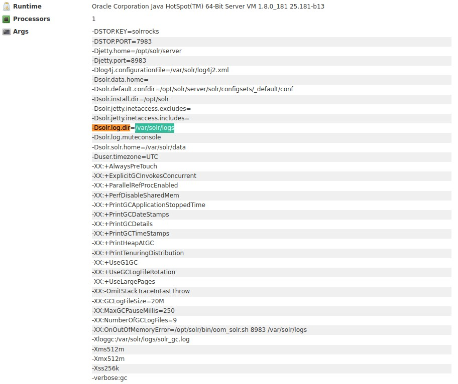

# TryHackMe [Solar](https://tryhackme.com/room/solar)
## Reconnaissance
### What service is running on port 8983?
```bash
$ nmap -sV -p 8983 10.10.255.198
PORT     STATE SERVICE VERSION
8983/tcp open  http    Apache Solr
```

**Answer**: `Apache Solr`
## Discovery
### Take a close look at the first page visible when navigating to `http://10.10.255.198:8983`. You should be able to see clear indicators that log4j is in use within the application for logging activity. **What is the `-Dsolr.log.dir` argument set to, displayed on the front page?**


**Answer**: `/var/solr/logs`
## Download the attached files. One file has a significant number of `INFO` entries showing repeated requests to one specific URL endpoint. **Which file includes contains this repeated entry?**
**Answer**: `solr.log`
## What path or URL endpoint is indicated in these repeated entries?
**Answer**: `/admin/cores`
## Viewing these log entries, what field name indicates some data entrypoint that you as a user could control?
**Answer**: `params`
## Exploitation